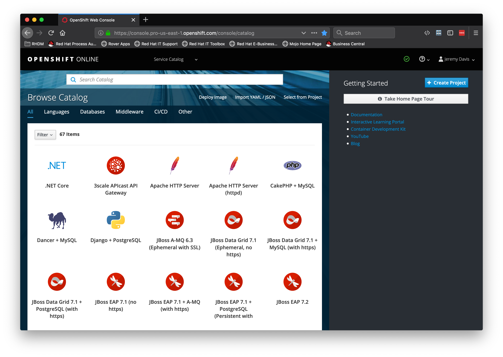
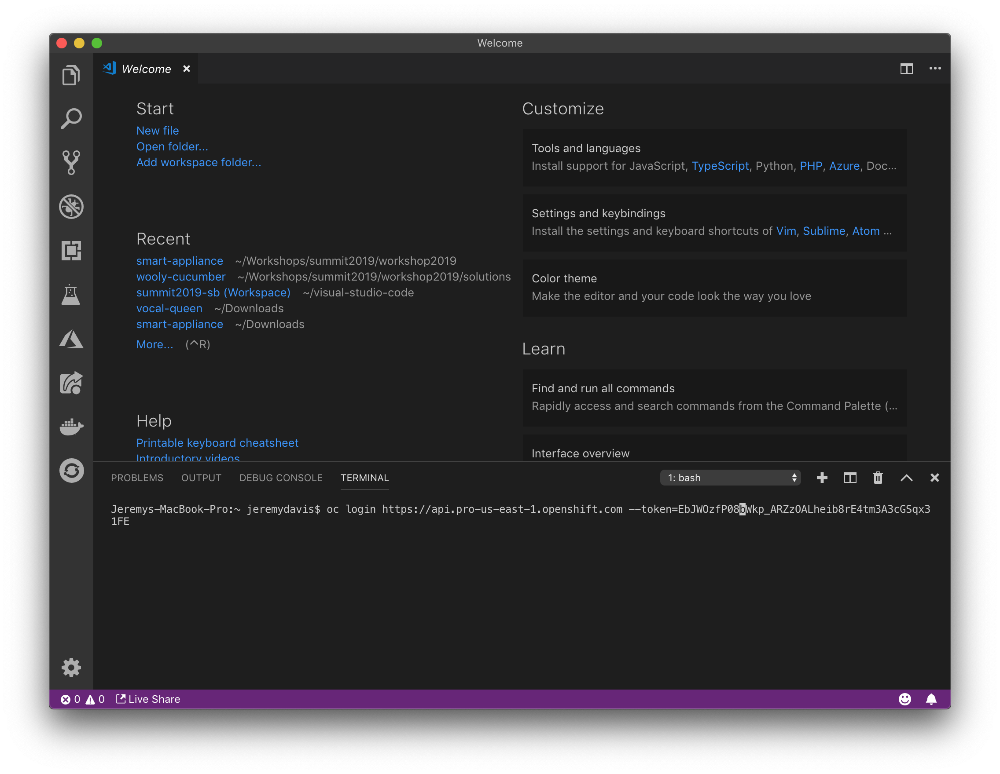

# Lab 2: Log into OpenShift

## Steps

1.  Log into the OpenShift web console
2.  Create a new project
3.  Log in from your laptop

### Log into the OpenShift web console

URL: https://master.35b7.summit.opentlc.com

Open the url provided by your instructor and log in with your username and password.  Your username/password combination will be something like user15/r3dh4t1!

NOTE: Your browser will probably warn you about the site's certificate.  Don't worry about that.

  

### Your projects

You have 2 projects in your cluster, "istio-system," and "userXX-insult-app.""  "istio-system" will be used for the Istio lab, and "userXX-insult-app" will be used for the other labs.

### Log in from your laptop

You can log in from a command prompt or from the terminal inside of Visual Studio Code. The first step is to get the login command from the OpenShift console.  Click on your name in the top right of the screen and choose, "Copy Login Command."  This puts the login command in your clipboard.

  

If you are working from a command prompt simply paste the command into the prompt and enter it:

```bash

oc login https://api.pro-us-east-1.openshift.com --token=EbJWOzrH7bWkp_ARZzOALheibhQoAtm3A4Ftq23cGSqx31UU

```

If you prefer using the terminal in Visual Studio Code open a new terminal by choosing "Terminal -> New Terminal" from the top menu and pasting the command into the new terminal window.

  

You are now ready to start coding!

