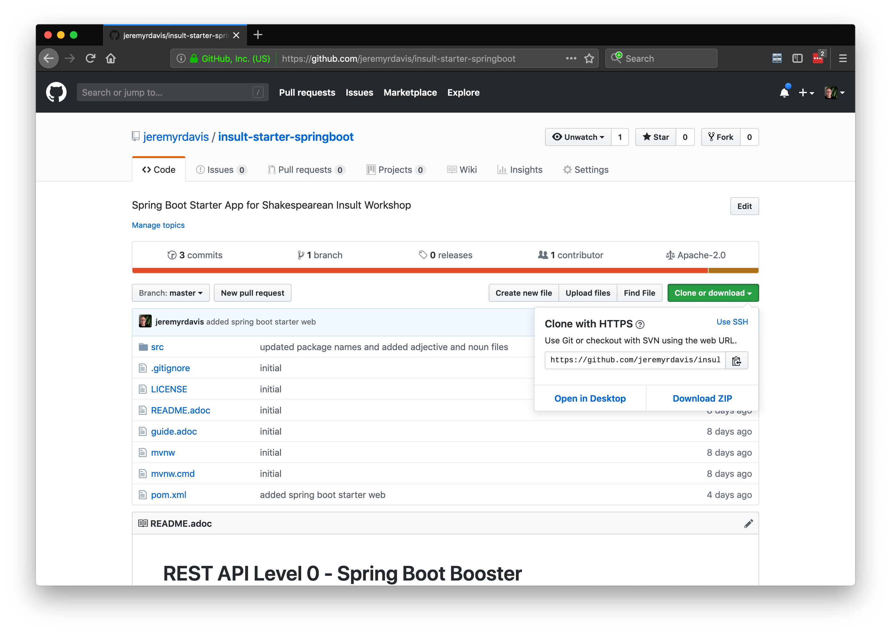
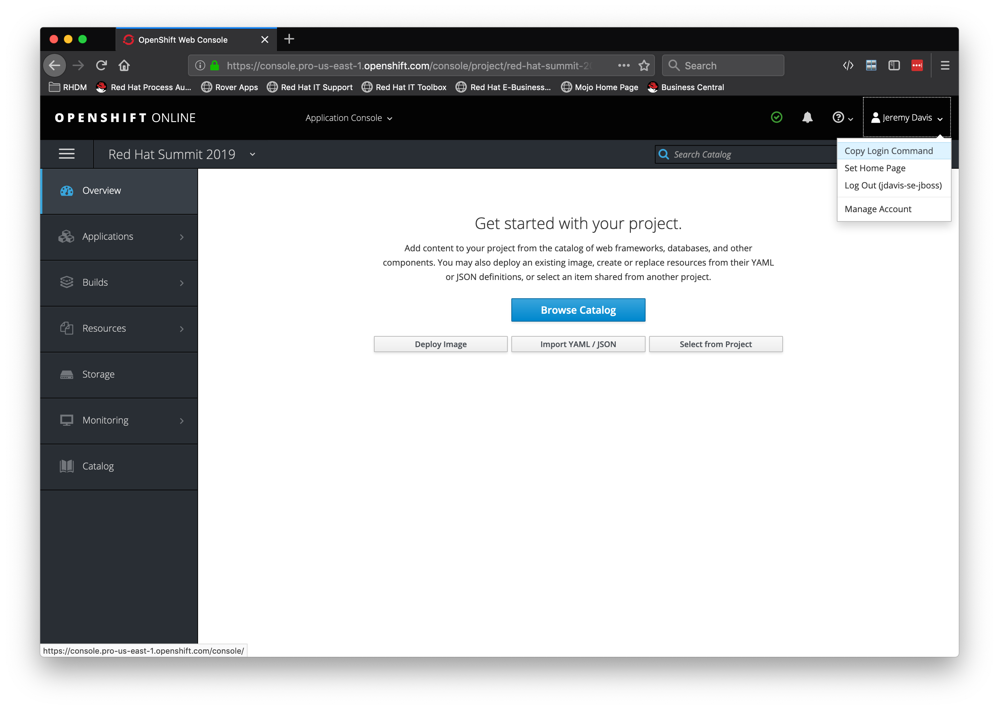
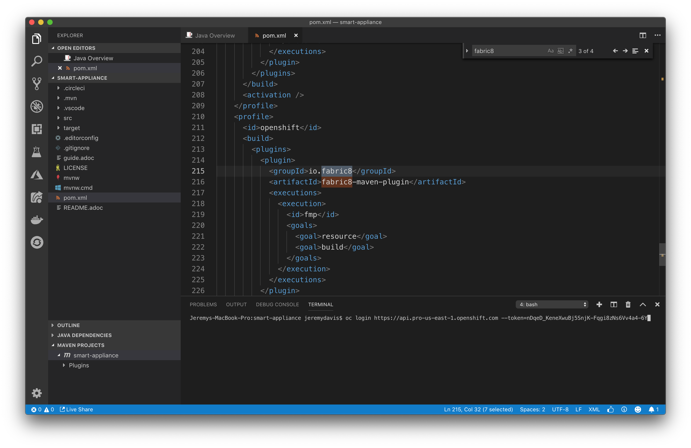
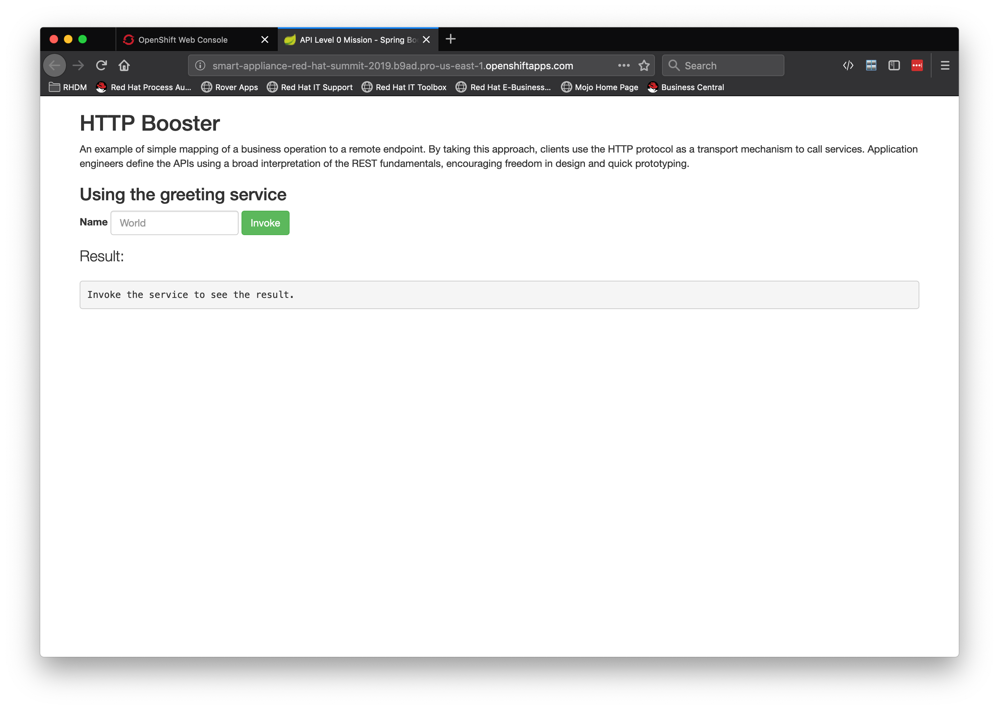

# Lab-3-NodeJS-Adjective_Service.md

## Create a Project for the NodeJS Adjective Service  

### Clone the app

```bash

git clone https://github.com/jeremyrdavis/insult-starter-nodejs.git

```

### Or download the project zip file

You can download the zip file from Github by opening https://github.com/jeremyrdavis/insult-starter-springboot
and choosing, "Download ZIP" from the green, "Clone or Download" button

  

### Rename the folder

Rename the folder from "insult-starter-nodejs" to "insult-adjectives"

### Import the app into VS Code

Open Visual Studio Code, choose "Open," and navigate to the root folder of the project

### Update the package.json file

Change the name to "insult-adjectives"  from "insult-starter-nodejs":

```json

{
  "name": "insult-adjectives",
  "version": "1.0.0",

```

### Update the package-lock.json file

Change the name to "insult-adjectives"  from "insult-starter-nodejs":

```json

{
  "name": "insult-adjectives",
  "version": "1.0.0",

```

### Build and run

Open a Terminal from Visual Studio Code by choosing "Terminal -> New Terminal" from the menu.  Run npm install and npm start:

```bash

    npm install && npm start

```

### Deploy to OpenShift

You may still be logged into OpenShift.  You can check by running the following command:

```bash

oc whoami

```

If the response is your username then you are still logged in.  If you are still logged in you can skip the next step.

#### Log back in to OpenShift

Nodeshift will build a Docker container and deploy it to OpenShift for us, but we need to be logged in first.  From your OpenShift console copy the login command by clicking on your name in the top right and choosing, "Copy Login Command."

  

Paste and enter the command into your terminal

  


```bash

    npm install && npm run openshift

```
### Validating the deployment:  

1. Login to OpenShift Console - with your user name and password
2. Click on Project ‘red-hat-summit-2019’ if you are not already in that project
3. You should see 1 running pod and a url that you can access
4. Try the url

You should see:

  


  

## Get coding!

### Create and fail a JUnit Test for our endpoint

We are of course practicing TDD in this tutorial so our first step will be to write a Unit Test.  Create a new class, "TwitterServiceTest.java," in the "src/test/java/com/redhat/summit2019" directory with the following content:

```javascript

const test = require('tape');
const supertest = require('supertest');

const app = require('../app');

test('test adjective', t => {
  supertest(app)
    .get('/api/greeting')
    .expect('Content-Type', /json/)
    .expect(200)
    .then(response => {
      t.not(response.body.content, null);
      t.end();
    });
});

````

```bash

    npm test

```

Your test should of course fail.  If it doesn't feel free to raise your hand and ask for help

```bash

> insult-adjectives@1.0.0 test /insults-adjectives
> tape test/*.js | tap-spec


  test adjective

    ✔ should not be equal

  test out greeting route with no query param

    ✔ should be equal

  test out greeting route with a query param

    ✔ should be equal


  total:     3
  passing:   3
  duration:  161ms
```

### Stub out an adjective method

Add the following method to app.js:

```javascript

app.use('/api/adjective', (request, response) => {
  const name = request.query ? request.query.name : undefined;
  response.send({content: `Verily, ye be a malmsey-nosed, unmuzzled whey-face!`});
});

```

And re-run the tests, which this time, should pass:

```bash

    npm test

    ...

    total:     3
    passing:   3
    duration:  165ms

```
Of course we aren't actually doing anything.

### Load adjectives from a text file

#### Create a database

Create a new folder, "lib," in the project directory.  Create a file, "db.js" in "lib" directory with the following code:

```javascript

'use strict';

/**
 * A simple database of words from a text file. Each word
 * in the file is separated by a newline.
 */

module.exports = exports = function textDb (file) {
  const fs = require('fs');
  const data = [];
  fs.readFileSync(file, 'utf-8')
    .split('\n')
    .reduce((accum, word) => {
      if (word && word.trim() !== '') data.push(word.trim());
    }, data);

  function get () {
    return data[Math.floor(Math.random() * data.length)];
  }

  return {
    get
  };
};

```

#### Import the database functionality

Import the db functionality at the top of app.js:

```javascript

    const db = require('./lib/db')('./adjectives.txt');

```

Create a new method to return adjectives:

```javascript

    app.use('/api/adjective', (request, response) => {
      response.json({ adjective: db.get() });
    });

```

Re-run the tests, which should now pass:

```javascript

    npm test

```    

Verify by starting node:

```javascript

    npm start

```    

You should see JSON similar to the following:

```javascript

{"adjective":"lumpish"}

```
