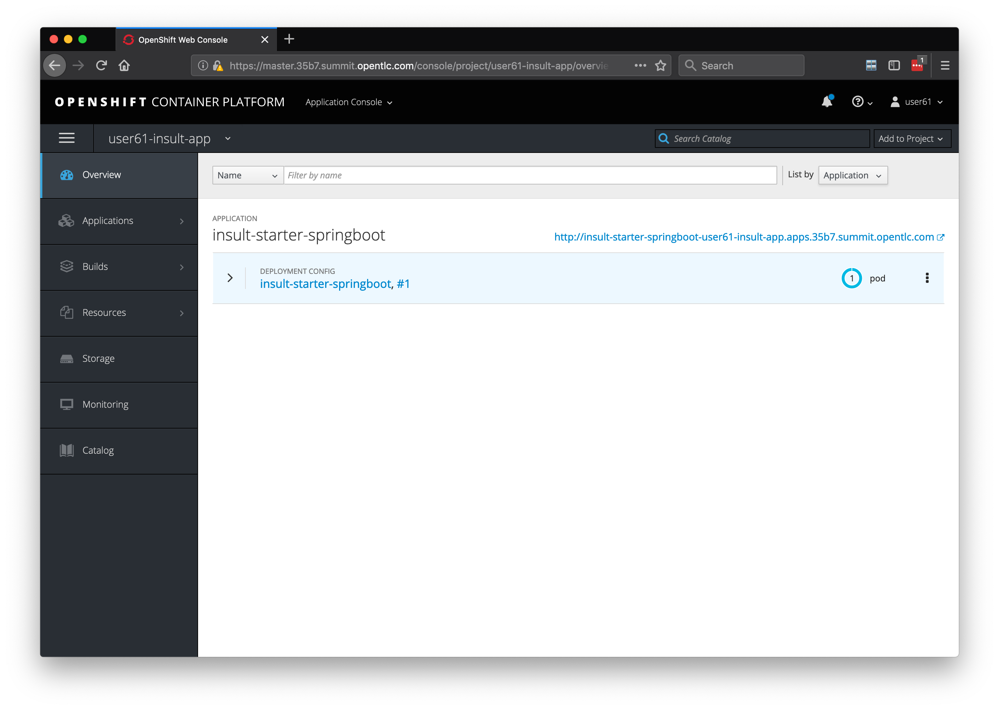

# Lab 3:  Creating a SpringBoot Adjective Services

## Description

In this lab we will create a rest service that returns an adjective.

The idea of this lab is to generate to random adjective to be used when creating insults. It is based on the following idea:  
http://www.literarygenius.info/a1-shakespearean-insults-generator.htm  

### Steps

1. Clone or download a starter app from Github
2. Build and deploy to verify our starter app
3. Create a test to excercise our functionality
4. Implement the functionality
5. Re-deploy

The project is based on the REST level 0 example application from OpenShift Launcher.  You can find OpenShift Launcher at https://launch.openshift.io 

## Set the active project

Use the oc application to see which project you are using:

```bash

oc projects

...

* istio-system
userXX-insult-app

```

If you do not have an asterisk next to userXX-insult-app run the following command to set userXX-insult-app as the active project:

```bash

oc project userXX-insult-app

```

##  Clone the repository 

```bash

git clone https://github.com/jeremyrdavis/insult-starter-springboot

```

### Download the project zip file

If you don't have Git, or if you simply prefer to work from a zip file you can download a zip file of the project from Github at https://github.com/jeremyrdavis/insult-starter-springboot
by choosing, "Download ZIP" from the green, "Clone or Download" button

  

## Rename the Folder

Rename the folder from "insult-starter-springboot" to "adjective-service"

## Import the app into VS Code

Open Visual Studio Code, choose "Open," and navigate to the root folder of the project

## Update the project settings

We need to update our project's settings from the default starter app to the adjective service we are building.

Open the pom.xml file and change the artifactId, name, and description to 
"insult-adjectives," "Spring Boot Insult Adjective Service," and "Spring Boot Insult App for Shakespearean Insults Workshop."

```xml

  <artifactId>insult-adjectives</artifactId>
  <version>1.0.0</version>
  <name>Spring Boot Insult Adjective Service</name>
  <description>Spring Boot Insult App for Shakespearean Insults Workshop</description>

```

## Build the app

We will use Maven to build our app.  Open a new Terminal either from the command line or within Visual Studio Code by choosing, "Terminal -> New Terminal"


```bash

mvn clean package

```

The tests should all complete successfully, and you should see a success message.

  

  


## Deploying to OpenShift  

### Building a Docker container for OpenShift

We will use the Fabric8 Maven Plugin to deploy our application to OpenShift.  The fabric8 plugin is already part of your pom.xml.

```xml

          <plugin>
            <groupId>io.fabric8</groupId>
            <artifactId>fabric8-maven-plugin</artifactId>
            <executions>
              <execution>
                <id>fmp</id>
                <goals>
                  <goal>resource</goal>
                  <goal>build</goal>
                </goals>
              </execution>
            </executions>
          </plugin>

```

You can read more about the Fabric8 project here, http://fabric8.io/

From the terminal run the following maven command:

```bash

mvn clean fabric8:deploy -Popenshift  

```

This build will take longer because we are building Docker containers in addition to our Spring Boot application.  When the build and push to OpenShift is complete you will see a success message similar to the following:

```bash
[INFO] F8: HINT: Use the command `oc get pods -w` to watch your pods start up
[INFO] ------------------------------------------------------------------------
[INFO] BUILD SUCCESS
[INFO] ------------------------------------------------------------------------
[INFO] Total time:  06:40 min
[INFO] Finished at: 2019-04-24T12:49:12-04:00
[INFO] ------------------------------------------------------------------------
```

#### Validating the deployment:  

1. Login to OpenShift Console - with user userXX/r3dh4t1!
2. Click on Project ‘userXX-insult-app’ if you are not already in that project
3. You should see 1 running pod and a url that you can access
4. Try the url


  


You should see:


  


##  Write code!

Now that we got an understanding of how to build our application and deploy it to OpenShift it's time to implement some actual functionality.  We need a REST endpoint that returns an adjective.

We will be following Test Driven Development in this tutorial so our first step is to create a Unit Test.  We will use JUnit in this application.

### Create and fail a JUnit Test for our endpoint

1. Create a new class, "AdjectiveServiceTest," in the "com.redhat.summit2019" package ("src/main/java/com/redhat/summit2019/AdjectiveServiceTest.java.")

Enter the following content:

```java

package com.redhat.summit2019;

import static io.restassured.RestAssured.given;
import static org.junit.Assert.assertNotNull;

import org.junit.Test;
import org.junit.runner.RunWith;
import org.springframework.beans.factory.annotation.Value;
import org.springframework.boot.test.context.SpringBootTest;
import org.springframework.test.context.junit4.SpringRunner;

import io.restassured.response.Response;

@RunWith(SpringRunner.class)
@SpringBootTest(webEnvironment = SpringBootTest.WebEnvironment.RANDOM_PORT)
public class AdjectiveServiceTest {

    private static final String ENDPOINT_PATH = "api/adjective";

    @Value("${local.server.port}")
    private int port;

    @Test
    public void testAdjectiveEndpoint() {
        Response response = given()
           .baseUri(baseURI())
           .get(ENDPOINT_PATH)
           .then()
           .statusCode(200)
           .extract().response();
        assertNotNull(response);
        System.out.println(response.toString());
    }

    protected String baseURI() {
        return String.format("http://localhost:%d", port);
    }
}

```

Run the test either by Clicking the "Run Test" link in the IDE (just under the @Test annotation) or in the terminal with:

```bash

mvn clean test -Dtest=AdjectiveServiceTest

```

The test should of course fail.  If for some reason your test passes feel free to raise your hand and ask for help.


### Pass our JUnit test

#### Adjective domain model

We are only returning a String and don't really need a domain model, but we are going to pretend that we are creating a full application and create a domain model with an Adjective class.

First create a new package "com.redhat.summit2019.model" ("src/main/java/com/redhat/summit2019/model.")  Second create a class, "Adjective" in the new model package ("src/main/java/com/redhat/summit2019/model/Adjective.java"):


```java

package com.redhat.summit2019.model;

import java.util.Objects;

public class Adjective {


    private String adjective;

    public Adjective() {
    }

    public Adjective(String adjective) {
        this.adjective = adjective;
    }

    public String getAdjective() {
        return adjective;
    }

    public Adjective adjective(String adjective) {
        this.adjective = adjective;
        return this;
    }

    @Override
    public boolean equals(Object o) {
        if (this == o) return true;
        if (o == null || getClass() != o.getClass()) return false;
        Adjective adjective1 = (Adjective) o;
        return Objects.equals(adjective, adjective1.adjective);
    }

    @Override
    public int hashCode() {
        return Objects.hash(adjective);
    }

    @Override
    public String toString() {
        final StringBuffer sb = new StringBuffer("Adjective{");
        sb.append("adjective='").append(adjective).append('\'');
        sb.append('}');
        return sb.toString();
    }

}

```

### Create an AdjectiveRepository

Spring Data uses a repository abstraction to reduce boilerplate database code.  If you are familiar with Spring Boot you are familiar with classes like CrudRepository and JpaRepository.

In this tutorial we will use a text file instead of a database to keep things simple.  However, we will follow the Spring Data convention and create an AdjectiveRepository.

Create a new package, "com.redhat.summit2019.repository," and add a new class, "AdjectiveRepository," ("/src/main/java/com/redhat/summit2019/repository/AdjectiveRepository.java") with the following code:

```java

package com.redhat.summit2019.repository;

import java.util.ArrayList;
import java.util.List;
import java.io.BufferedReader;
import java.io.InputStream;
import java.io.InputStreamReader;
import java.util.Random;

import com.redhat.summit2019.model.Adjective;
import org.springframework.core.io.ClassPathResource;
import org.springframework.core.io.Resource;
import org.springframework.stereotype.Component;

@Component("adjectiveStore")
public class AdjectiveRepository {

    private List<Adjective> adjectives = new ArrayList<>();

    public AdjectiveRepository(){
        try {
            Resource resource = new ClassPathResource("adjectives.txt");
            InputStream is = resource.getInputStream();
            if (is != null) {
                BufferedReader reader = new BufferedReader(new InputStreamReader(is));
                reader.lines()
                        .forEach(adj -> adjectives.add(new Adjective(adj.trim())));
            }
        } catch (Exception e) {
            e.printStackTrace();
        }
    }

    public Adjective getRandomAdjective(){
        return adjectives.get(new Random().nextInt(adjectives.size()));
    }


}

```

### Create an AdjectiveService

We now have everything we need to return an Adjective.  It is time to create an AdjectiveService to expose the REST endpoint.  Create a new class, "AdjectiveService," in the package, "com.redhat.summit2019.service" with the following code:


```java

package com.redhat.summit2019.service;

import javax.ws.rs.GET;
import javax.ws.rs.Path;
import javax.ws.rs.Produces;

import com.redhat.summit2019.model.Adjective;
import com.redhat.summit2019.repository.AdjectiveRepository;
import org.springframework.beans.factory.annotation.Autowired;
import org.springframework.stereotype.Component;

@Path("/adjective")
@Component
public class AdjectiveService {

    @Autowired
    private AdjectiveRepository adjectiveStore;
    
    @GET
    @Produces("application/json")
    public Adjective adjective() {
        return adjectiveStore.getRandomAdjective();
    }
}

```

Re-run the test case and verify that it passes.

### Re-deploy to OpenShift

From the terminal run the following maven command:

```bash

mvn clean fabric8:deploy -Popenshift  

```

This build will take longer because we are building Docker containers in addition to our Spring Boot application.  When the build and push to OpenShift is complete you will see a success message similar to the following:

```bash
[INFO] F8: HINT: Use the command `oc get pods -w` to watch your pods start up
[INFO] ------------------------------------------------------------------------
[INFO] BUILD SUCCESS
[INFO] ------------------------------------------------------------------------
[INFO] Total time:  06:40 min
[INFO] Finished at: 2019-04-24T12:49:12-04:00
[INFO] ------------------------------------------------------------------------
```

### Recap

Our first service is complete!

