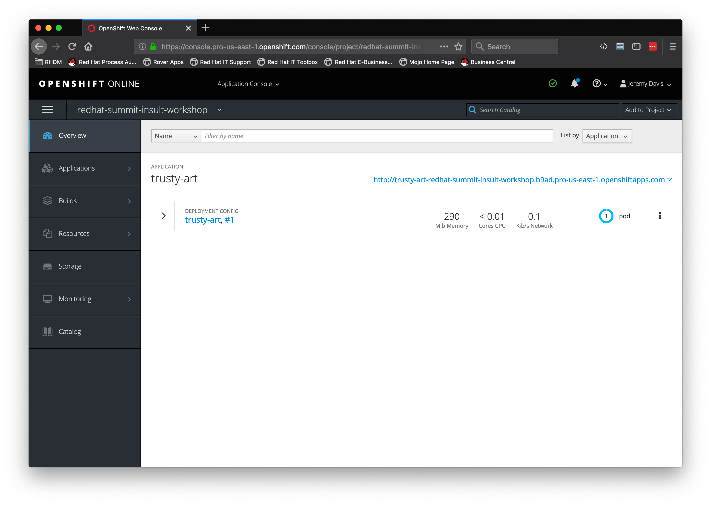
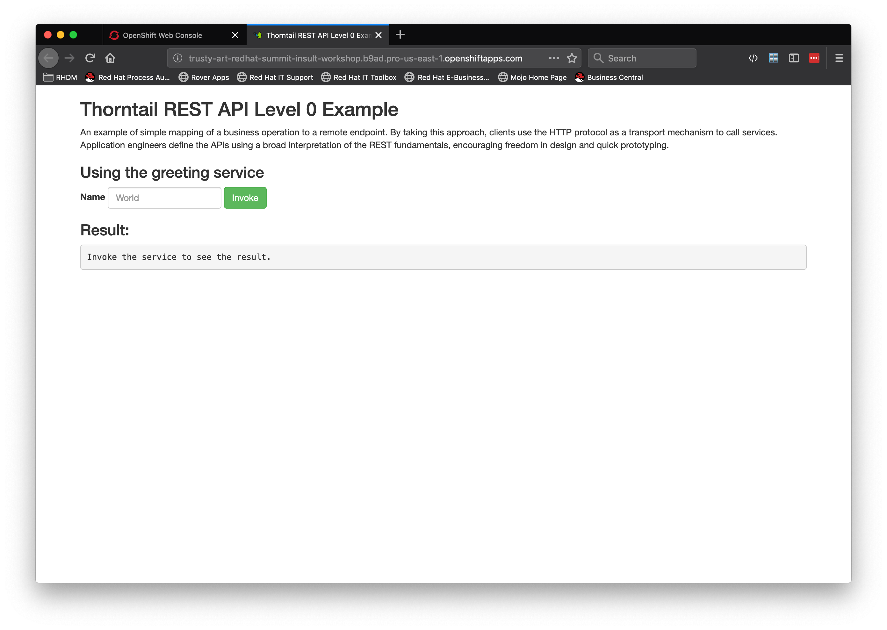
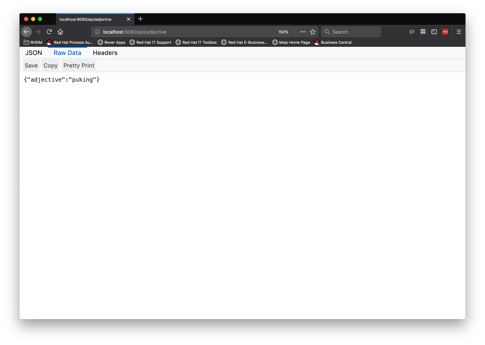

# Lab 3:  Creating a Thorntail Adjective Services

## Pre-requisites 

Must have Visual Studio Code, JDK 8 or above

## Get the starter project up and running

###  Clone the repository 

```bash

git clone https://github.com/jeremyrdavis/insult-starter-thorntail.git

```

### Download the project zip file

You can download the zip file from Github instead of cloning it by opening 

TODO: INSERT_ZIP_DOWNLOAD

and choosing, "Download ZIP" from the green, "Clone or Download" button

  


##### Rename the Folder

Rename the folder from "insult-starter-thorntail" to "adjective-service"

### Import the app into VS Code

Open Visual Studio Code, choose "Open," and navigate to the root folder of the project

  

##### Update the project settings

We need to update our project's settings from the default starter app to the adjective service we are building.

Open the pom.xml file and change the artifactId and name to 
"insult-adjectives," and "Thorntail Adjective Service."

```xml

<project xmlns="http://maven.apache.org/POM/4.0.0" xmlns:xsi="http://www.w3.org/2001/XMLSchema-instance" xsi:schemaLocation="http://maven.apache.org/POM/4.0.0 http://maven.apache.org/xsd/maven-4.0.0.xsd">
  <modelVersion>4.0.0</modelVersion>
  <groupId>com.redhat.summit2019</groupId>
  <artifactId>adjective-service</artifactId>
  <version>1.0.0</version>
  <packaging>war</packaging>
  <name>Thorntail Adjective Service</name>

```

### Build the app

We will use Maven to build our app.  Open a new Terminal either from the command line or within Visual Studio Code by choosing, "Terminal -> New Terminal"


```bash

mvn clean package

```

The tests should all complete successfully, and you should see a success message.

  

### Deploying to OpenShift  

If you have followed along in the labs you should already be logged into OpenShift.  You can verify by typing the following into your terminal:

```bash

 oc whoami

```

The response will be your user name if you are logged in.  If you aren't you can copy the login command from the top right of your OpenShift terminal and log in again.

  

Type the command into your terminal:

```bash

oc login https://api.pro-us-east-1.openshift.com --token=EbJWOzrH7bWkp_ARZzOALheibhQoAtm3A4Ftq23cGSqx31UU

```

or into the terminal in Visual Studio Code:

  

*IMPORTANT: Be sure to set the appropriate project after logging in*

```bash

 oc project red-hat-summit-insults-userXX

```


### Building a Docker container for OpenShift

We will use the Fabric8 Maven Plugin to deploy our application to OpenShift.  The fabric8 plugin is already part of your pom.xml.  You can find it in the <plugins></plugins> section of the pom.xml

```xml

          <plugin>
            <groupId>io.fabric8</groupId>
            <artifactId>fabric8-maven-plugin</artifactId>
            <version>${version.fabric8-maven-plugin}</version>
            <executions>
              <execution>
                <goals>
                  <goal>resource</goal>
                  <goal>build</goal>
                </goals>
              </execution>
            </executions>
            <configuration>
              <generator>
                <includes>
                  <include>thorntail-v2</include>
                </includes>
                <excludes>
                  <exclude>webapp</exclude>
                </excludes>
              </generator>
              <enricher>
                <config>
                  <thorntail-v2-health-check>
                    <path>/</path>
                  </thorntail-v2-health-check>
                </config>
              </enricher>
            </configuration>
          </plugin>

```

You can read more about the Fabric8 project here, http://fabric8.io/

From the terminal run the following maven command:

```bash

mvn clean fabric8:deploy -Popenshift  

```

This build will take longer because we are building Docker containers in addition to our Spring Boot application.  When the build and push to OpenShift is complete you will see a success message similar to the following:

```bash

[INFO] F8: HINT: Use the command `oc get pods -w` to watch your pods start up
[INFO] ------------------------------------------------------------------------
[INFO] BUILD SUCCESS
[INFO] ------------------------------------------------------------------------
[INFO] Total time:  06:40 min
[INFO] Finished at: 2019-04-24T12:49:12-04:00
[INFO] ------------------------------------------------------------------------

```

### Verify OpenShift deployment

You should see your pod running in OpenShift, and clicking on the url should display the default "Greeting" application.

  

  

##  Create Adjective Rest Service

Now that we got an understanding of how to build our application and deploy it to OpenShift it's time to implement some actual functionality.  We need a REST endpoint that returns an adjective.

We will be following Test Driven Development in this tutorial so our first step is to create a Unit Test.  We will use JUnit in this application.

### Create and fail a JUnit Test for our endpoint

Create a class, "AdjectiveResourceTest" in the test directory's "com.redhat.summit2019" package with the following code:

```java

package com.redhat.summit2019;

import org.jboss.arquillian.container.test.api.RunAsClient;
import org.jboss.arquillian.junit.Arquillian;
import org.junit.Assert;
import org.junit.Test;
import org.junit.runner.RunWith;
import org.wildfly.swarm.arquillian.DefaultDeployment;

import javax.ws.rs.client.Client;
import javax.ws.rs.client.ClientBuilder;
import javax.ws.rs.client.WebTarget;
import javax.ws.rs.core.MediaType;
import javax.ws.rs.core.Response;

@RunWith(Arquillian.class)
@DefaultDeployment
public class AdjectiveResourceTest {
    @Test
    @RunAsClient
    public void serviceInvocation() {
        Client client = ClientBuilder.newClient();
        WebTarget target = client.target("http://localhost:8080")
                .path("api").path("adjective");

        Response response = target.request(MediaType.APPLICATION_JSON).get();
        Assert.assertEquals(200, response.getStatus());
        Assert.assertNotNull(response.readEntity(String.class));
    }

}

```

Run the test either by Clicking the "Run Test" link in the IDE (just under the @Test annotation) or in the terminal with:

```bash

mvn clean test -Dtest=AdjectiveResourceTest

```

The test should of course fail.

### Pass our JUNit Test

1. Create an Adjective domain model
2. Create an AdjectiveResource to return an Adjective in JSON

#### Adjective domain model

We are only returning a String and don't really need a domain model, but to be consistent with real applications let's create an Adjective for our domain model.  Create a class, "Adjective" in the package, "io.openshift.booster.adjectives.model"


```java

package com.redhat.summit2019.model;

import java.util.Objects;

public class Adjective {


    private String adjective;

    public Adjective() {
    }

    public Adjective(String adjective) {
        this.adjective = adjective;
    }

    public String getAdjective() {
        return adjective;
    }

    public Adjective adjective(String adjective) {
        this.adjective = adjective;
        return this;
    }

    @Override
    public boolean equals(Object o) {
        if (this == o) return true;
        if (o == null || getClass() != o.getClass()) return false;
        Adjective adjective1 = (Adjective) o;
        return Objects.equals(adjective, adjective1.adjective);
    }

    @Override
    public int hashCode() {
        return Objects.hash(adjective);
    }

    @Override
    public String toString() {
        final StringBuffer sb = new StringBuffer("Adjective{");
        sb.append("adjective='").append(adjective).append('\'');
        sb.append('}');
        return sb.toString();
    }

}

```

#### AdjectiveResource

We will create an AdjectiveResource to return an adjective in JSON format.  We would typically inject an EntityManager and lookup an Adjective from a database.  

```java

    @PersistenceContext(unitName = "MyPU")
    private EntityManager em;

    ....

    @GET
    @Path("/{id}")
    @Produces(MediaType.APPLICATION_JSON)
    public Adjective getSingle(@PathParam("id") Integer id) {
        return em.find(Adjective.class, id);
    }


```

In this workshop we will load the adjectives from a file and store them in an ArrayList.  We will use the @PostConstruct method to load the Adjectives into a List as soon as the class is instantiated and then return a randomly selected Adjective from the list:

```java

    @PostConstruct
    public void loadData() {
        try {
            InputStream is = this.getClass().getClassLoader().getResourceAsStream("adjectives.txt");
            if (is != null) {
                BufferedReader reader = new BufferedReader(new InputStreamReader(is));
                reader.lines()
                        .forEach(adj -> adjectives.add(new Adjective(adj.trim())));
            }
        } catch (Exception e) {
            e.printStackTrace();
        }
    }

```


```java

package com.redhat.summit2019;

import java.io.BufferedReader;
import java.io.InputStream;
import java.io.InputStreamReader;
import java.util.ArrayList;
import java.util.List;
import java.util.Random;

import javax.annotation.PostConstruct;
import javax.enterprise.context.ApplicationScoped;
import javax.ws.rs.DefaultValue;
import javax.ws.rs.GET;
import javax.ws.rs.Path;
import javax.ws.rs.Produces;
import javax.ws.rs.QueryParam;

import com.redhat.summit2019.model.Adjective;

@Path("/adjective")
@ApplicationScoped
public class AdjectiveResource {

    private List<Adjective> adjectives = new ArrayList<>();

    @GET
    @Path("/")
    @Produces("application/json")
    public Adjective greeting() {
        return adjectives.get(new Random().nextInt(adjectives.size()));
    }

    @PostConstruct
    public void loadData() {
        try {
            InputStream is = this.getClass().getClassLoader().getResourceAsStream("adjectives.txt");
            if (is != null) {
                BufferedReader reader = new BufferedReader(new InputStreamReader(is));
                reader.lines()
                        .forEach(adj -> adjectives.add(new Adjective(adj.trim())));
            }
        } catch (Exception e) {
            e.printStackTrace();
        }
    }

}

```

Re-run the test case and verify that it passes.

##### Verify locally

Let's fire up Thorntail and check out the endpoint in a browser.  Inside of your project's "target" directly you will find a jar ending in "-thorntail.jar."  This is the jar we need to run:

```bash

java -jar ./target/adjective-service-1.0.0-thorntail.jar

```

  

### Re-deploy to OpenShift

From the terminal run the following maven command:

```bash

mvn clean fabric8:deploy -Popenshift  

```

This build will take longer because we are building Docker containers in addition to our Spring Boot application.  When the build and push to OpenShift is complete you will see a success message similar to the following:

```bash
[INFO] F8: HINT: Use the command `oc get pods -w` to watch your pods start up
[INFO] ------------------------------------------------------------------------
[INFO] BUILD SUCCESS
[INFO] ------------------------------------------------------------------------
[INFO] Total time:  06:40 min
[INFO] Finished at: 2019-04-24T12:49:12-04:00
[INFO] ------------------------------------------------------------------------
```


