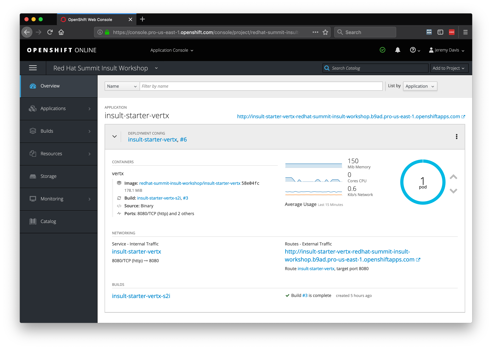
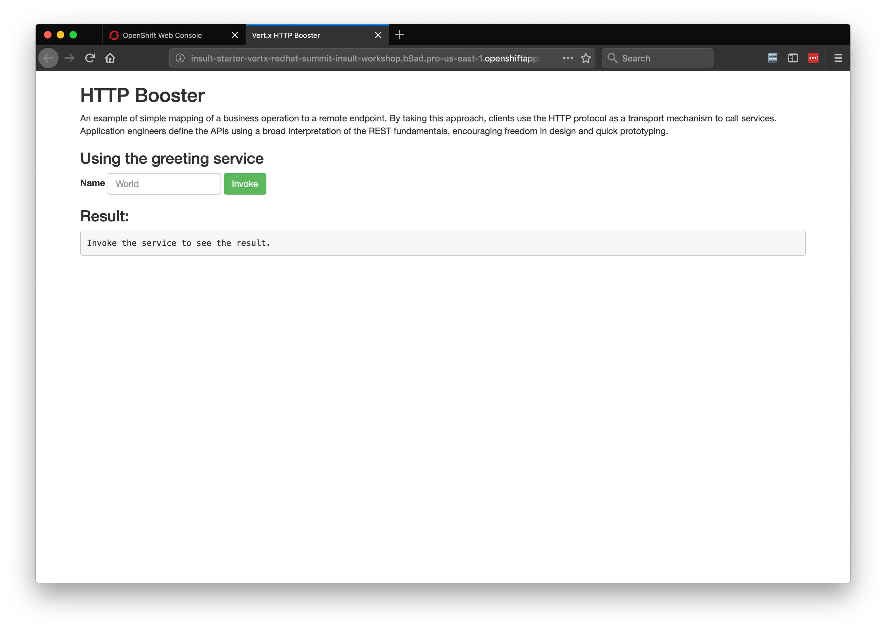

# Lab 3:  Creating a Vert.x Adjective Services

## Pre-requisites 

Must have completed labs 1-3. We will be using those components for following labs

## Description

The idea of this lab is to generate to random noun and an adjective to generate an insult. It is based on the following idea:  
http://www.literarygenius.info/a1-shakespearean-insults-generator.htm  

## Steps

1. Create a new project in OpenShift (if you haven't already)
2. Clone or download the sample project from Github
3. Add the necessary functionality to return adjectives

The project we use will be based on the REST level 0 example application from OpenShift Launcher.  You can find OpenShift Launcher at https://launch.openshift.io 


## Create a new project in OpenShift

Log into your OpenShift console if you haven't already.  Create a new project from the blue, "Create Project" button on the top right of the screen.  Our example uses the name, "red-hat-summit-2019."

  
  
  


##  Clone or download the repository 

```bash

git clone https://github.com/jeremyrdavis/insult-starter-vertx.git

```

Download the zip file from Github by opening https://github.com/jeremyrdavis/insult-starter-vertx
and choosing, "Download ZIP" from the green, "Clone or Download" button

  

## Import the app into VS Code

Open Visual Studio Code, choose "Open," and navigate to the root folder of the project

### Update the app

Our first step will be to customize the starter application.  Open the pom.xml and change lines 5, 8 and 9 to be "insult-adjectives," "Insult Adjectives," and "Red Hat Summit 2019 Insult Workshop Adjectives Service" respectively:

```xml

3  <modelVersion>4.0.0</modelVersion>
4  <groupId>com.redhat.summit2019</groupId>
5  <artifactId>insult-adjectives</artifactId>
6  <version>1.0.0</version>
7  <packaging>jar</packaging>
8  <name>Insult Adjectives</name>
9  <description>Red Hat Summit 2019 Insult Workshop Adjectives Service</description>

``` 

## Building and deploying

### Building the app

We will use Maven to build our app.  Open a new Terminal either from the command line or within Visual Studio Code by choosing, "Terminal -> New Terminal"


```bash

mvn clean package

```

The tests should all complete successfully, and you should see a success message.

  

### Deploying to OpenShift  

#### Building a Docker container for OpenShift

We will use the Fabric8 Maven Plugin to deploy our application to OpenShift.  The fabric8 plugin is already part of your pom.xml.  Check out lines 115-140:

```xml
          <plugin>
            <groupId>io.fabric8</groupId>
            <artifactId>fabric8-maven-plugin</artifactId>
            <executions>
              <execution>
                <id>fmp</id>
                <goals>
                  <goal>resource</goal>
                  <goal>build</goal>
                </goals>
              </execution>
            </executions>
          </plugin>

```

You can read more about the Fabric8 project here, http://fabric8.io/

#### Log in to OpenShift

Fabric8 will build a Docker container and deploy it to OpenShift for us, but we need to be logged in first.  From your OpenShift console copy the login command by clicking on your name in the top right and choosing, "Copy Login Command."

  

Paste and enter the command into your terminal

  


#### Build and deploy to OpenShift

Now we can deploy our app.  From the terminal run the following maven command:

```bash

mvn clean fabric8:deploy -Popenshift 

```

This build will take longer because we are building Docker containers in addition to our Spring Boot application.  When the build and push to OpenShift is complete you will see a success message similar to the following:

```bash
[INFO] F8: HINT: Use the command `oc get pods -w` to watch your pods start up
[INFO] ------------------------------------------------------------------------
[INFO] BUILD SUCCESS
[INFO] ------------------------------------------------------------------------
[INFO] Total time:  06:40 min
[INFO] Finished at: 2019-04-24T12:49:12-04:00
[INFO] ------------------------------------------------------------------------
```
### Verify OpenShift deployment

You should see your pod running in OpenShift, and clicking on the url should display the default "Greeting" application.

  

  

##  Create Adjective Rest Service

Now that we got an understanding of how to build our application and deploy it to OpenShift it's time to implement some actual functionality.  We need a REST endpoint that returns an adjective.

We will be following Test Driven Development in this tutorial so our first step is to create a Unit Test.  We will use JUnit in this application.

### Create and fail a JUnit Test for our endpoint

Testing reactive, asynchronouse code is different than testing traditional, imperative code.  Vert.x provides "Vertx Unit" to make writing asynchronous unit tests easier.  You can find the dependency on line 54 of the project's pom.xml:

```xml

    <dependency>
      <groupId>io.vertx</groupId>
      <artifactId>vertx-unit</artifactId>
      <scope>test</scope>
    </dependency>

```

The Vertx Unit Api borrows from existing test frameworks like JUnit or QUnit and follows typical Vert.x practices.

Let's get started wiht asynchronous testing.  Create a TestCase, "AdjectiveEndpointTest" in the "com.redhat.summit2019" package.  The test case will make an asynchronous call to our Adjective endpoint and verify that we get a result.

Add the following content to the AdjectiveEndpointTest class:

```java

package com.redhat.summit2019;

import com.redhat.summit2019.model.Adjective;
import io.vertx.core.DeploymentOptions;
import io.vertx.core.Vertx;
import io.vertx.core.file.AsyncFile;
import io.vertx.core.file.OpenOptions;
import io.vertx.core.json.JsonObject;
import io.vertx.core.parsetools.RecordParser;
import io.vertx.ext.unit.Async;
import io.vertx.ext.unit.TestContext;
import io.vertx.ext.unit.junit.VertxUnitRunner;
import io.vertx.ext.web.client.WebClient;
import org.junit.After;
import org.junit.Assert;
import org.junit.Before;
import org.junit.Test;
import org.junit.runner.RunWith;

import java.util.ArrayList;
import java.util.List;

import static junit.framework.TestCase.assertTrue;

@RunWith(VertxUnitRunner.class)
public class AdjectiveEndpointTest {

    private static final int PORT = 8081;

    private Vertx vertx;
    private WebClient client;

    @Before
    public void before(TestContext context) {
        vertx = Vertx.vertx();
        vertx.exceptionHandler(context.exceptionHandler());
        vertx.deployVerticle(HttpApplication.class.getName(),
            new DeploymentOptions().setConfig(new JsonObject().put("http.port", PORT)),
            context.asyncAssertSuccess());
        client = WebClient.create(vertx);
    }

    @After
    public void after(TestContext context) {
        vertx.close(context.asyncAssertSuccess());
    }

    @Test
    public void callAdjectiveEndpoint(TestContext context) {
        // Send a request and get a response
        Async async = context.async();
        client.get(PORT, "localhost", "/api/adjective")
            .send(resp -> {
                context.assertTrue(resp.succeeded());
                context.assertEquals(resp.result().statusCode(), 200);
                String adjective = resp.result().bodyAsJsonObject().getString("adjective");
                Assert.assertNotNull(adjective);
                async.complete();
            });
    }
}

```

There are 2 things happening in the Before method that we will look at.  First we use our class' Vertx instance to configure our TestContext and deploy our Verticle:

```java

        vertx = Vertx.vertx();
        vertx.exceptionHandler(context.exceptionHandler());
        vertx.deployVerticle(HttpApplication.class.getName(),
            new DeploymentOptions().setConfig(new JsonObject().put("http.port", PORT)),
            context.asyncAssertSuccess());

```

Second we get a Vertx WebClient from our TestContext.  We will use the WebClient to excercise our endpoint in the test method.

```java

        client = WebClient.create(vertx);

```

There are also 2 import things to take note of in the test mthod:

1.  The method takes a single argument, "TestContext."  Vertx Unit provides a TestContext that is used for performing assertions and completing the test

```java

    @Test
    public void callAdjectiveEndpoint(TestContext context) {
        // Send a request and get a response
        ...
    }

```

2.  The TestContext provides us with get an "Async" object, and we complete the test by calling, "async.complete()"

```java

    @Test
    public void callAdjectiveEndpoint(TestContext context) {
        // Send a request and get a response
        Async async = context.async();
        client.get(PORT, "localhost", "/api/adjective")
            .send(resp -> {
                
                ...
                
                async.complete();
            });
    }

```

3.  We use the Vertx WebClient to call our endpoint

```java

        client.get(PORT, "localhost", "/api/adjective")
            .send(resp -> {

                ...

            });
    }

```

4.  We excercise asserting with the TestContext

```java

    context.assertTrue(resp.succeeded());
    context.assertEquals(resp.result().statusCode(), 200);

```

Run the test either by Clicking the "Run Test" link in the IDE (just under the @Test annotation) or in the terminal with:

```bash

mvn clean test -Dtest=AdjectiveEndpointTest

```

The test should of course fail.


//-------------------------------------------------------------------------------------------------

Let's get started wiht asynchronous testing.  Create a TestCase, "AdjectiveEndpointTest" in the "com.redhat.summit2019" package.  The test case will make an asynchronous call to our Adjective endpoint and verify the result against a Collection of Adjectives in memory.

Add the following content which we will dive into below:

```java

package com.redhat.summit2019;

import com.redhat.summit2019.model.Adjective;
import io.vertx.core.DeploymentOptions;
import io.vertx.core.Vertx;
import io.vertx.core.file.AsyncFile;
import io.vertx.core.file.OpenOptions;
import io.vertx.core.json.JsonObject;
import io.vertx.core.parsetools.RecordParser;
import io.vertx.ext.unit.Async;
import io.vertx.ext.unit.TestContext;
import io.vertx.ext.unit.junit.VertxUnitRunner;
import io.vertx.ext.web.client.WebClient;
import org.junit.After;
import org.junit.Before;
import org.junit.Test;
import org.junit.runner.RunWith;

import java.util.ArrayList;
import java.util.List;

import static junit.framework.TestCase.assertTrue;

@RunWith(VertxUnitRunner.class)
public class AdjectiveEndpointTest {

    private static final int PORT = 8081;

    private Vertx vertx;
    private WebClient client;

    private List<Adjective> adjectives;

    @Before
    public void before(TestContext context) {
        adjectives = new ArrayList<Adjective>();
        vertx = Vertx.vertx();
        vertx.exceptionHandler(context.exceptionHandler());
        vertx.deployVerticle(HttpApplication.class.getName(),
            new DeploymentOptions().setConfig(new JsonObject().put("http.port", PORT)),
            context.asyncAssertSuccess());
        client = WebClient.create(vertx);

        // Load the adjectives
        RecordParser recordParser = RecordParser.newDelimited("\n", bufferedLine -> {
            adjectives.add(new Adjective(bufferedLine.toString()));
        });

        AsyncFile asyncFile = vertx.fileSystem().openBlocking("adjectives.txt", new OpenOptions());

        asyncFile.handler(recordParser)
                .endHandler(v -> {
                    asyncFile.close();
                });
    }

    @After
    public void after(TestContext context) {
        vertx.close(context.asyncAssertSuccess());
    }

    @Test
    public void callAdjectiveEndpoint(TestContext context) {
        // Send a request and get a response
        Async async = context.async();
        client.get(PORT, "localhost", "/api/adjective")
            .send(resp -> {
                context.assertTrue(resp.succeeded());
                context.assertEquals(resp.result().statusCode(), 200);
                Adjective adjective = resp.result().bodyAsJson(Adjective.class);
                assertTrue(adjectives.contains(adjective));
                async.complete();
            });
    }
}

```

There are 2 particularly interesting parts of this test case.  First the test method, "callAdjectiveEndpoint" :

```java

    @Test
    public void callAdjectiveEndpoint(TestContext context) {
        // Send a request and get a response
        Async async = context.async();
        client.get(PORT, "localhost", "/api/adjective")
            .send(resp -> {
                context.assertTrue(resp.succeeded());
                context.assertEquals(resp.result().statusCode(), 200);
                Adjective adjective = resp.result().bodyAsJson(Adjective.class);
                assertTrue(adjectives.contains(adjective));
                async.complete();
            });
    }

```

There are 3 things to take note of in this method:
1.  The method takes a single argument, "TestContext."  Vertx Unit provides a TestContext that is used for performing assertions and completing the test
2.  The TestContext provides us with get an "Async" object, and complete the test by calling, "async.complete()"
3.  We call "response.bodyAsJson()," pass in an object from our domain model, and get back that object without doing any marshalling from JSON

Second, our "@Before" method:

```java

    @Before
    public void before(TestContext context) {
        adjectives = new ArrayList<Adjective>();
        vertx = Vertx.vertx();
        vertx.exceptionHandler(context.exceptionHandler());
        vertx.deployVerticle(HttpApplication.class.getName(),
            new DeploymentOptions().setConfig(new JsonObject().put("http.port", PORT)),
            context.asyncAssertSuccess());
        client = WebClient.create(vertx);

        // Load the adjectives
        RecordParser recordParser = RecordParser.newDelimited("\n", bufferedLine -> {
            adjectives.add(new Adjective(bufferedLine.toString()));
        });

        AsyncFile asyncFile = vertx.fileSystem().openBlocking("adjectives.txt", new OpenOptions());

        asyncFile.handler(recordParser)
                .endHandler(v -> {
                    asyncFile.close();
                });
    }

```

There are several things happening in the Before method that we will look at.

1.  We use our class' Vertx instance to configure our TestContext and deploy our Verticle:

```java

        vertx = Vertx.vertx();
        vertx.exceptionHandler(context.exceptionHandler());
        vertx.deployVerticle(HttpApplication.class.getName(),
            new DeploymentOptions().setConfig(new JsonObject().put("http.port", PORT)),
            context.asyncAssertSuccess());

```

2.  We get a Vertx WebClient from our TestContext.  We will use the WebClient to excercise our endpoint in the test method.

```java

        client = WebClient.create(vertx);

```

3.  We load a list of adjectives into memory asynchronously:

```java

        // Load the adjectives
        RecordParser recordParser = RecordParser.newDelimited("\n", bufferedLine -> {
            adjectives.add(new Adjective(bufferedLine.toString()));
        });

        AsyncFile asyncFile = vertx.fileSystem().openBlocking("adjectives.txt", new OpenOptions());

        asyncFile.handler(recordParser)
                .endHandler(v -> {
                    asyncFile.close();
                });

```


