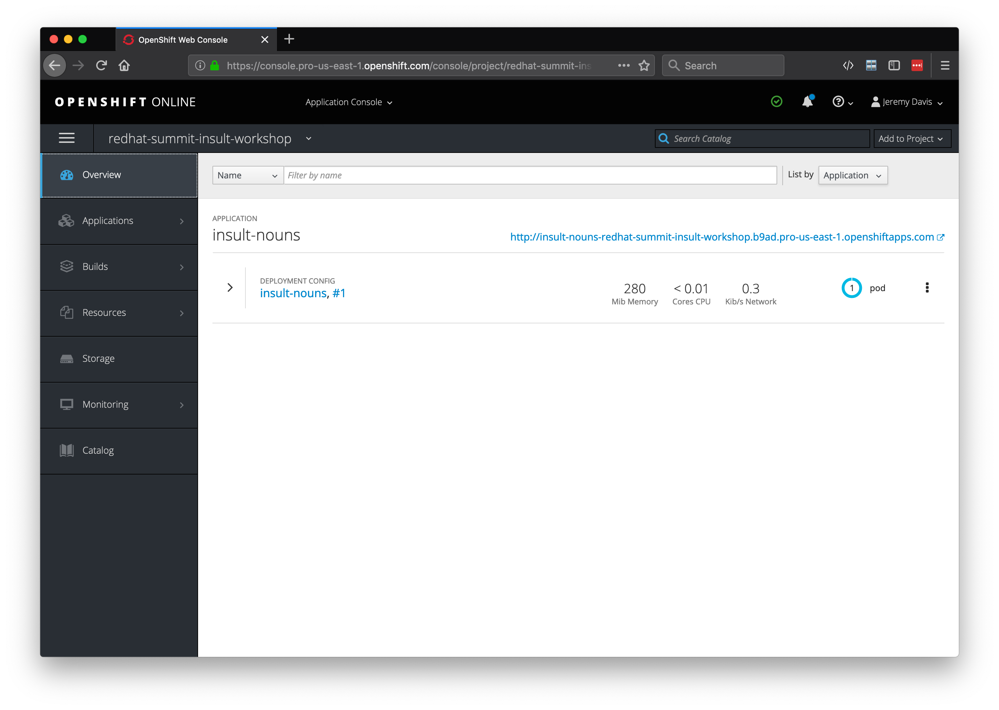
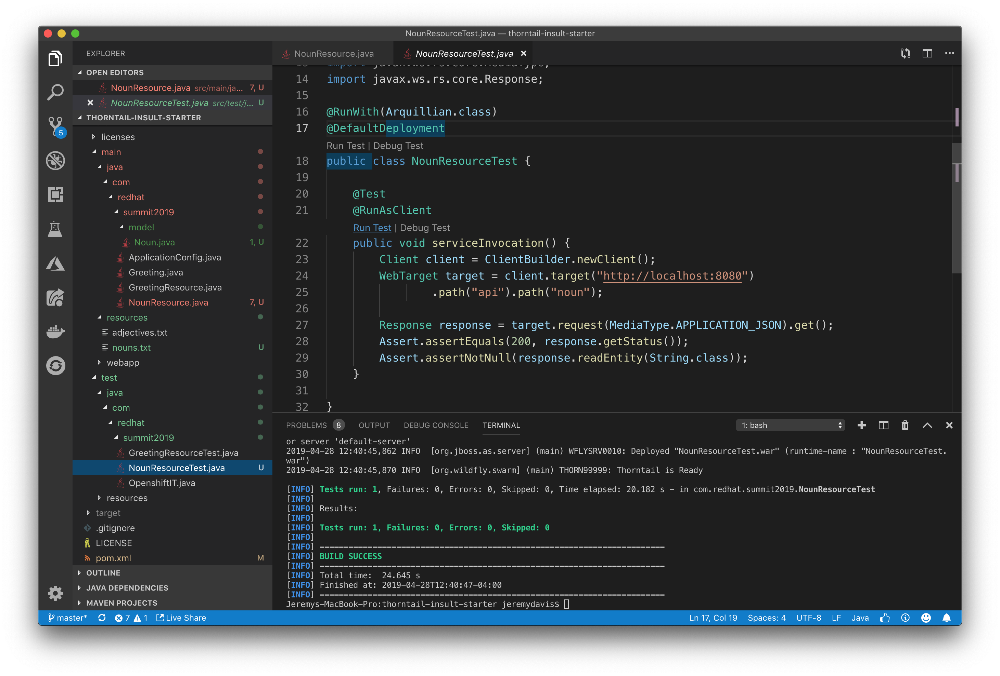
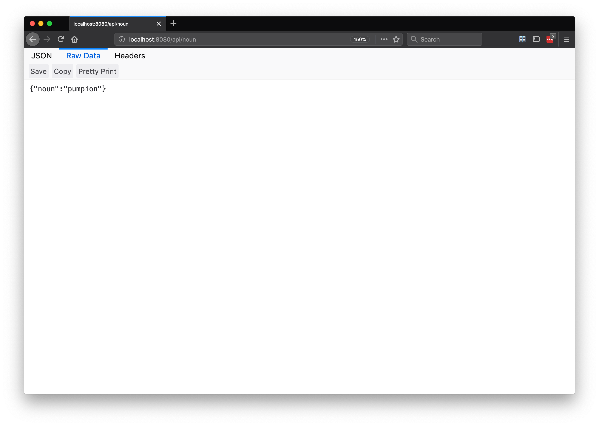
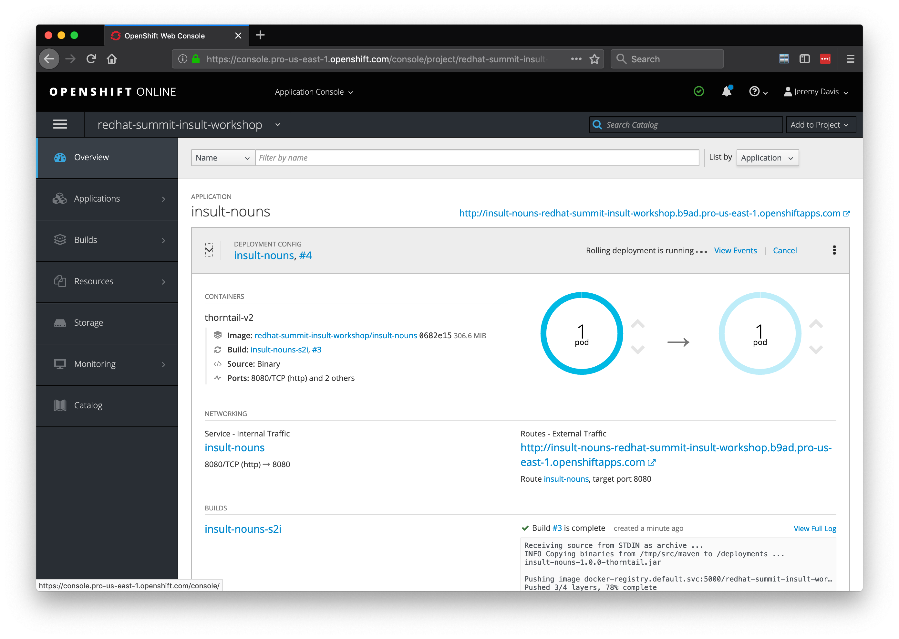

# Lab 4:  Creating Thorntail Noun Services

## Create Noun Thorntail Rest Service  

###  Clone the repository 

```bash

git clone https://github.com/jeremyrdavis/thorntail-insult-starter.git

```

### Or download the project zip file

Download the zip file from Github by opening https://github.com/jeremyrdavis/thorntail-insult-starter-zip and choosing, "Download ZIP" from the green, "Clone or Download" button

  

## Change project folder name to insult-nouns

Please change the project name from thorntail-insult-starter to insult-nouns


### Import the app into VS Code

Open Visual Studio Code, choose "Open," and navigate to the root folder of the project

### Update the app

Our first step will be to customize the starter application.  Open the pom.xml and change the following:

```xml

  <modelVersion>4.0.0</modelVersion>
  <groupId>com.redhat.summit2019</groupId>
  <artifactId>insult-nouns</artifactId>
  <version>v1</version>
  <packaging>war</packaging>
  <name>Insult Nouns</name>

``` 

  

### Build the app

We will use Maven to build our app.  Open a new Terminal either from the command line or within Visual Studio Code by choosing, "Terminal -> New Terminal"


```bash

mvn clean package

```

The tests should all complete successfully, and you should see a success message.

  


### Deploying to OpenShift  

#### Building a Docker container for OpenShift

We will use the Fabric8 Maven Plugin to deploy our application to OpenShift.  The fabric8 plugin is already part of your pom.xml.  Check out lines 214-226:

```xml

          <plugin>
            <groupId>io.fabric8</groupId>
            <artifactId>fabric8-maven-plugin</artifactId>
            <executions>
              <execution>
                <id>fmp</id>
                <goals>
                  <goal>resource</goal>
                  <goal>build</goal>
                </goals>
              </execution>
            </executions>
          </plugin>

```

You can read more about the Fabric8 project here, http://fabric8.io/


#### Log in to OpenShift

You may still be logged into OpenShift.  You can check by running the following command:

```bash

oc whoami

```

If the response is your username then you are still logged in.  If you are still logged in you can skip the next step.

Fabric8 will build a Docker container and deploy it to OpenShift for us, but we need to be logged in first.  From your OpenShift console copy the login command by clicking on your name in the top right and choosing, "Copy Login Command."

  

Paste and enter the command into your terminal

  


#### Build and deploy to OpenShift

Now we can deploy our app.  From the terminal run the following maven command:

```bash

mvn clean fabric8:deploy -Popenshift  

```

This build will take longer because we are building Docker containers in addition to our Spring Boot application.  When the build and push to OpenShift is complete you will see a success message similar to the following:

```bash

[INFO] F8: HINT: Use the command `oc get pods -w` to watch your pods start up
[INFO] ------------------------------------------------------------------------
[INFO] BUILD SUCCESS
[INFO] ------------------------------------------------------------------------
[INFO] Total time:  06:40 min
[INFO] Finished at: 2019-04-24T12:49:12-04:00
[INFO] ------------------------------------------------------------------------

```

  

  

#### Validating the deployment:  

1. Login to OpenShift Console - with your user name and password
2. Click on Project ‘red-hat-summit-2019’ if you are not already in that project
3. You should see 1 running pod and a url that you can access
4. Try the url


  


You should see:


  


##  Create Noun REST Service

Now that we know our basic application deploys we can begin implementing the functionality for our Noun Service.  We will take the same, test-driven approach as we did with the Adjective Service.

### Create and fail a JUnit Test for our endpoint

1. Create a new test class, NounResourceTest.java

Enter the following content:

```java

package com.redhat.summit2019;

import org.jboss.arquillian.container.test.api.RunAsClient;
import org.jboss.arquillian.junit.Arquillian;
import org.junit.Assert;
import org.junit.Test;
import org.junit.runner.RunWith;
import org.wildfly.swarm.arquillian.DefaultDeployment;

package com.redhat.summit2019;

import org.jboss.arquillian.container.test.api.RunAsClient;
import org.jboss.arquillian.junit.Arquillian;
import org.junit.Assert;
import org.junit.Test;
import org.junit.runner.RunWith;
import org.wildfly.swarm.arquillian.DefaultDeployment;

import javax.ws.rs.client.Client;
import javax.ws.rs.client.ClientBuilder;
import javax.ws.rs.client.WebTarget;
import javax.ws.rs.core.MediaType;
import javax.ws.rs.core.Response;

@RunWith(Arquillian.class)
@DefaultDeployment
public class NounResourceTest {
    @Test
    @RunAsClient
    public void serviceInvocation() {
        Client client = ClientBuilder.newClient();
        WebTarget target = client.target("http://localhost:8080")
                .path("api").path("noun");

        Response response = target.request(MediaType.APPLICATION_JSON).get();
        Assert.assertEquals(200, response.getStatus());
        Assert.assertNotNull(response.readEntity(String.class));
    }

}

```

Obviously to get this to compile we need an Noun model.  Let's create a new package "com.redhat.summit2019.model" (or directory "src/main/java/com/redhat/summit2019/model") in the src/main/java folder.

Add a class "Insult.java" in the package with the following content:

```java

package com.redhat.summit2019.model;

import java.util.Objects;

public class Noun {
    private String noun;

    public Noun() {
    }

    public Noun(String noun) {
        this.noun = noun;
    }

    public String getNoun() {
        return noun;
    }

    public Noun noun(String noun) {
        this.noun = noun;
        return this;
    }

    public boolean equals(Object o) {
        if (this == o)
            return true;
        if ((o == null) || (getClass() != o.getClass()))
            return false;
        Noun noun1 = (Noun) o;
        return Objects.equals(noun, noun);
    }

    public int hashCode() {
        return Objects.hash(new Object[] { noun });
    }

    public String toString() {
        StringBuffer sb = new StringBuffer("Noun{");
        sb.append("noun='").append(noun).append('\'');
        sb.append('}');
        return sb.toString();
    }
}

```
Run the test either by Clicking the "Run Test" link in the IDE (just under the @Test annotation) or in the terminal with:

```bash

mvn clean test -Dtest=TwitterResourceTest

```

Obviously our test should fail.  If for some reason it passes feel free to raise your hand and ask for help.

### Pass our JUnit test

#### Steps

##### Create NounResource

We will create a class, "NounResource."" to retrieve and return an adjective in JSON format.  In a typical MicroProfile application we would inject an EntityManager and lookup a Noun from a database.  

```java

    @PersistenceContext(unitName = "MyPU")
    private EntityManager em;

    ....

    @GET
    @Path("/{id}")
    @Produces(MediaType.APPLICATION_JSON)
    public Noun getSingle(@PathParam("id") Integer id) {
        return em.find(Noun.class, id);
    }


```

In this workshop we will load nouns from a file and store them in an ArrayList.  We will use the @PostConstruct method to load the Nouns into a List as soon as the class is instantiated and then return a randomly selected Noun from the list:


###  Create a TwitterResource Class  

Package: com.redhat.summit2019  
Name: TwitterResource  


  

```java

package com.redhat.summit2019;

import java.io.BufferedReader;
import java.io.InputStream;
import java.io.InputStreamReader;
import java.util.ArrayList;
import java.util.List;
import java.util.Random;

import javax.annotation.PostConstruct;
import javax.enterprise.context.ApplicationScoped;
import javax.ws.rs.DefaultValue;
import javax.ws.rs.GET;
import javax.ws.rs.Path;
import javax.ws.rs.Produces;
import javax.ws.rs.QueryParam;

import com.redhat.summit2019.model.Noun;

@Path("/noun")
@ApplicationScoped
public class NounResource {

    private List<Noun> nouns = new ArrayList<>();

    @GET
    @Path("/")
    @Produces("application/json")
    public Noun greeting() {
        return nouns.get(new Random().nextInt(nouns.size()));
    }

    @PostConstruct
    public void loadData() {
        try {
            InputStream is = this.getClass().getClassLoader().getResourceAsStream("nouns.txt");
            if (is != null) {
                BufferedReader reader = new BufferedReader(new InputStreamReader(is));
                reader.lines()
                        .forEach(adj -> nouns.add(new Noun(adj.trim())));
            }
        } catch (Exception e) {
            e.printStackTrace();
        }
    }

}

```

#### Re-run our JUnit test

Run the test either by Clicking the "Run Test" link in the IDE (just under the @Test annotation) or in the terminal with:

```bash

mvn clean test -Dtest=NounResourceTest

```

This time our test should pass.  If for some reason it fails feel free to raise your hand and ask for help.

  

#### Verify locally

Let's fire up Thorntail and check out the endpoint in a browser.  Inside of your project's "target" directly you will find a jar ending in "-thorntail.jar."  This is the jar we need to run:

```bash

java -jar ./target/insult-nouns-1.0.0-thonrtail.jar

```

  

### Re-deploy to OpenShift

From the terminal run the following maven command:

```bash

mvn clean fabric8:deploy -Popenshift  

```

This build will take longer because we are building Docker containers in addition to our Spring Boot application.  When the build and push to OpenShift is complete you will see a success message similar to the following:

```bash

[INFO] F8: HINT: Use the command `oc get pods -w` to watch your pods start up
[INFO] ------------------------------------------------------------------------
[INFO] BUILD SUCCESS
[INFO] ------------------------------------------------------------------------
[INFO] Total time:  06:40 min
[INFO] Finished at: 2019-04-24T12:49:12-04:00
[INFO] ------------------------------------------------------------------------

```

You can watch the application deploying from the OpenShift console, and the deployment number will be incremented

  

  

You can verify the endpoint by opening the url on openshift followed by "/api/noun."


## Summary

This completes the Noun microservice implementation in Thorntail.  For more information on Thorntail visit https://thorntail.io/  

