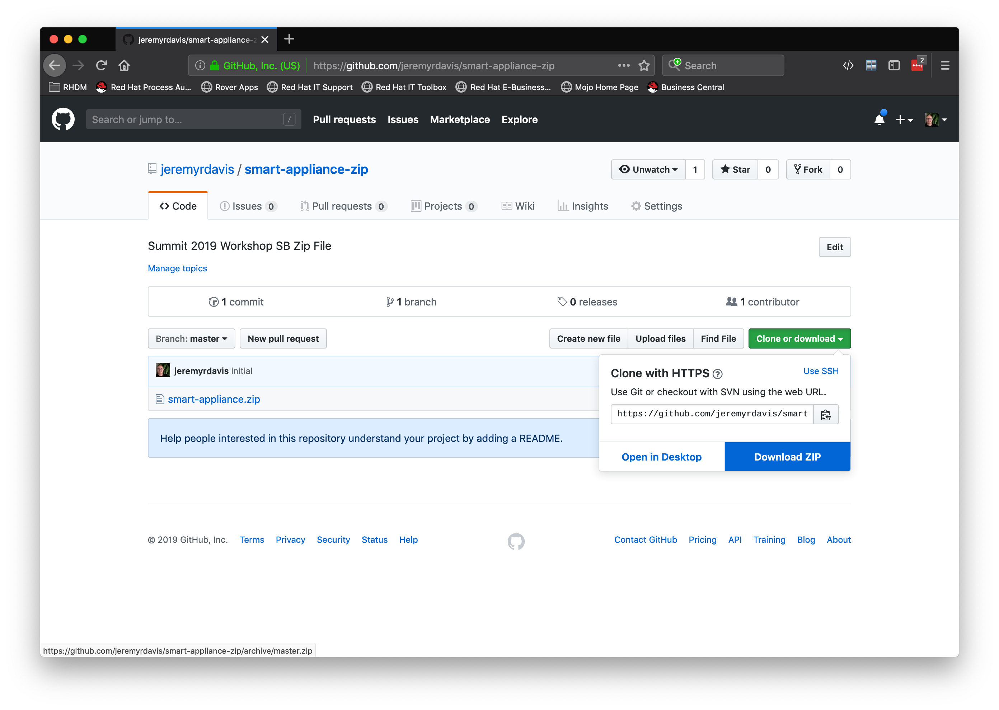
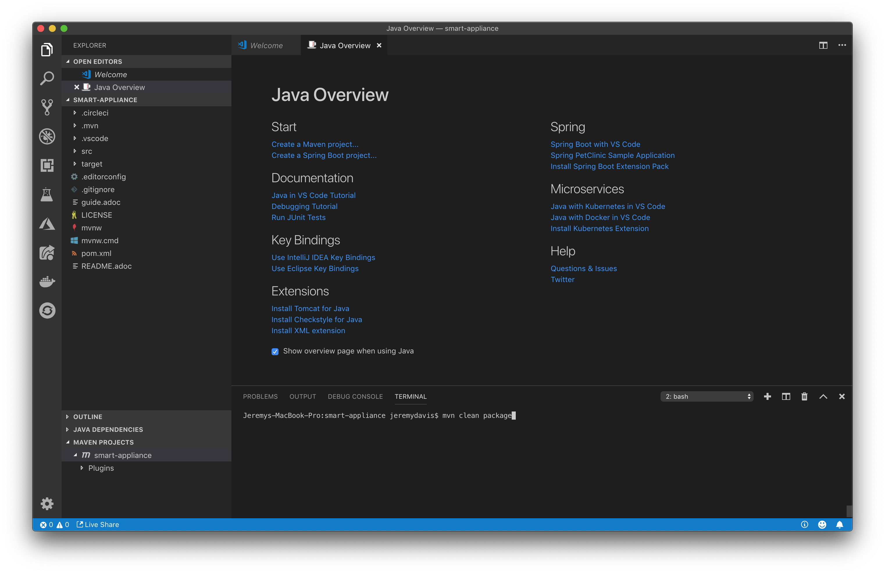
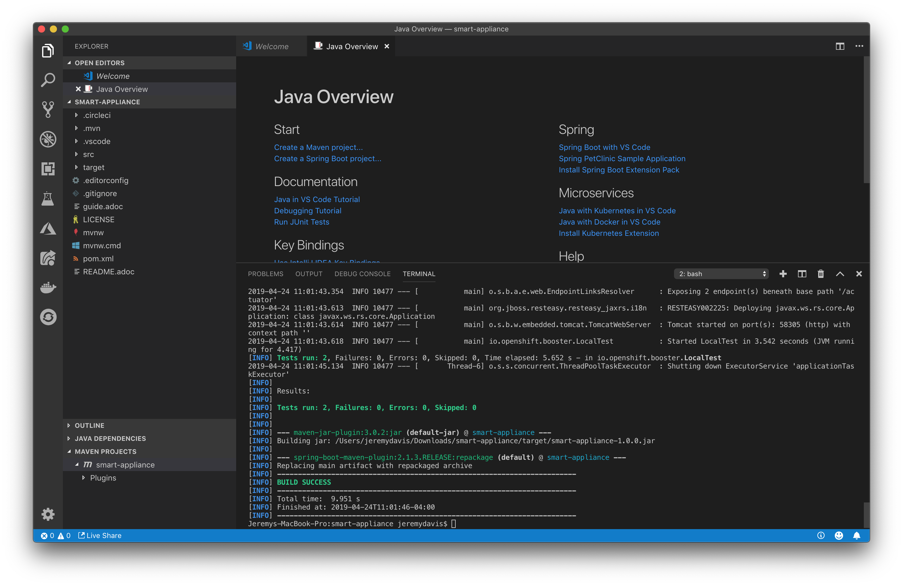
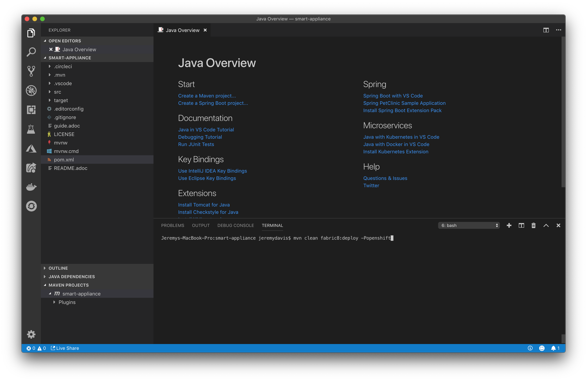
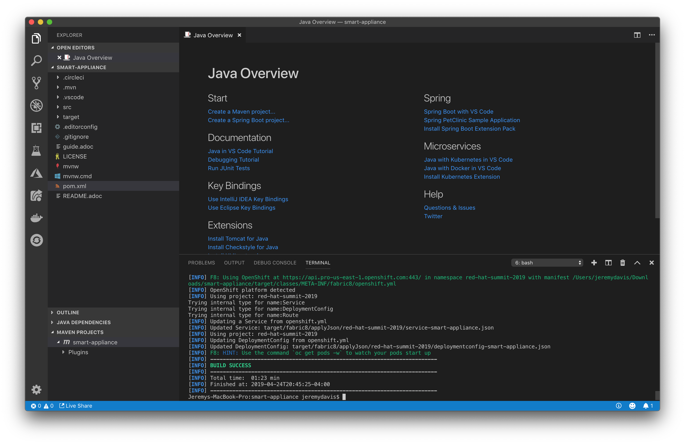

# Lab 5 SpringBoot Insult Service

## Create the Spring Boot Insult Service

In this lab we will create a microservice that returns a complete insult.  We will call the Adjective service twice, the Noun service, and concatenate the results with our basic insult text.

### Pre-requisites 

Must have completed labs 1-4. We will be using those components for this lab.

### Description

The idea of this lab is to call the Adjective and Noun services and generate a complete insult. It is based on the following idea:  
http://www.literarygenius.info/a1-shakespearean-insults-generator.htm  

###  Clone the repository 

```bash

git clone https://github.com/jeremyrdavis/insult-starter-springboot

```

### Or download the project zip file

Download the zip file from Github by opening https://github.com/jeremyrdavis/insult-starter-springboot and choosing, "Download ZIP" from the green, "Clone or Download" button

  

##### Rename the Folder
Rename the folder from "insult-starter-springboot" to "noun-service"

##### Import the app into VS Code

Open Visual Studio Code, choose "Open," and navigate to the root folder of the project

##### Update the project settings

We need to update our project's settings from the default starter app to the adjective service we are building.

Open the pom.xml file and change the artifactId, name, and description (lines 25-28) to 
"shakespearean-insults," "Spring Boot Sha Nouns Service," and "Spring Boot Noun Service for Shakespearean Insults Workshop."

```xml

25  <artifactId>shakespearean-insults</artifactId>
26  <version>1.0.0</version>
27  <name>Spring Boot Shakespearean Insults Service</name>
28  <description>Spring Boot Insults Service for Shakespearean Insults Workshop</description>

```

### Build the app

We will use Maven to build our app.  Open a new Terminal either from the command line or within Visual Studio Code by choosing, "Terminal -> New Terminal"


```bash

mvn clean package

```

The tests should all complete successfully, and you should see a success message.

  

  


### Deploying to OpenShift  

#### Building a Docker container for OpenShift

We will use the Fabric8 Maven Plugin to deploy our application to OpenShift.  The fabric8 plugin is already part of your pom.xml.  Check out lines 214-226:

```xml

          <plugin>
            <groupId>io.fabric8</groupId>
            <artifactId>fabric8-maven-plugin</artifactId>
            <executions>
              <execution>
                <id>fmp</id>
                <goals>
                  <goal>resource</goal>
                  <goal>build</goal>
                </goals>
              </execution>
            </executions>
          </plugin>

```

You can read more about the Fabric8 project here, http://fabric8.io/


#### Log in to OpenShift

You may still be logged into OpenShift.  You can check by running the following command:

```bash

oc whoami

```

If the response is your username then you are still logged in.  If you are still logged in you can skip the next step.

Fabric8 will build a Docker container and deploy it to OpenShift for us, but we need to be logged in first.  From your OpenShift console copy the login command by clicking on your name in the top right and choosing, "Copy Login Command."

  

Paste and enter the command into your terminal

  


#### Build and deploy to OpenShift

Now we can deploy our app.  From the terminal run the following maven command:

```bash

mvn clean fabric8:deploy -Popenshift  

```

This build will take longer because we are building Docker containers in addition to our Spring Boot application.  When the build and push to OpenShift is complete you will see a success message similar to the following:

```bash

[INFO] F8: HINT: Use the command `oc get pods -w` to watch your pods start up
[INFO] ------------------------------------------------------------------------
[INFO] BUILD SUCCESS
[INFO] ------------------------------------------------------------------------
[INFO] Total time:  06:40 min
[INFO] Finished at: 2019-04-24T12:49:12-04:00
[INFO] ------------------------------------------------------------------------

```

  

  


#### Validating the deployment:  

1. Login to OpenShift Console - with your user name and password
2. Click on your project if you are not already in that project
3. You should see running pods for the Adjective, Noun, and Insult services
4. Try the url for the Insult service

##  Create Insult REST Service

We will take the same, test-driven approach to building the Insult Service that we did for the Adjective and Noun Services.

### Create and fail a JUnit Test for our endpoint

1. Create a new test class, "InsultServiceTest.java," in the "com.redhat.summit2019" package of the test directory with the following content:

```java

package com.redhat.summit2019;

import static io.restassured.RestAssured.given;
import static org.junit.Assert.assertEquals;
import static org.junit.Assert.assertNotNull;

import org.junit.Test;
import org.junit.runner.RunWith;
import org.springframework.beans.factory.annotation.Value;
import org.springframework.boot.test.context.SpringBootTest;
import org.springframework.test.context.junit4.SpringRunner;

import io.restassured.response.Response;

@RunWith(SpringRunner.class)
@SpringBootTest(webEnvironment = SpringBootTest.WebEnvironment.RANDOM_PORT)
public class InsultServiceTest{

    private static final String ENDPOINT_PATH = "api/insult";

    @Value("${local.server.port}")
    private int port;

    @Test
    public void testAdjectiveEndpoint() {
        Response response = given()
           .baseUri(baseURI())
           .get(ENDPOINT_PATH)
           .then()
           .statusCode(200)
           .extract().response();
        assertNotNull(response);

        assertEquals("{\"insult\":\"Verily, ye be a puking, cockle-brained pantaloon\"}", response.body().asString());
    }

    protected String baseURI() {
        return String.format("http://localhost:%d", port);
    }
}

````

Run the test either by Clicking the "Run Test" link in the IDE (just under the @Test annotation) or in the terminal with:

```bash

mvn clean test -Dtest=InsultServiceTest

```

Obviously our test should fail.  If for some reason it passes feel free to raise your hand and ask for help.

*This test will become significantly more complicated as we build out our service*

### Pass our JUnit test

#### Steps

1.  Create a domain model with an Adjective, Noun, and Insult
2.  Create Spring RestTemplates to call the Adjective and Noun Services
3.  Create an InsultService that retrieves 2 adjectives and a noun and returns a complete Insult

####  Create our Domain Models  

We are only returning a String and don't really need a domain model, but to be consistent with the rest of the tutorial and of course real applications we will create a domain models for our application.  

Create classes for our three models, "Adjective," "Noun," and "Insult."

You may be wondering why we are re-creating the Adjective and Noun classes instead of using the ones we created earlier.  The answer is that we don't want any dependencies across our Services.

##### Insult domain model

First create a new folder under "src/main/java/com/redhat/summit2019" named, "model."  Second create a class, "Insult," in the package, "com.redhat.summit2019.model"

Our Insult model will contain 2 Adjectives and 1 Noun and will return an insult in the format of "Verily, ye be a cockle-brained, puking measle!"  

```java

package com.redhat.summit2019.model;

public class Insult {

    Adjective adjective1;

    Adjective adjective2;

    Noun noun;

    public Insult(Adjective adjective1, Adjective adjective2, Noun noun) {
        this.adjective1 = adjective1;
        this.adjective2 = adjective2;
        this.noun = noun;
    }

    public String getInsult() {
        StringBuilder builder = new StringBuilder();
        builder.append("Verily, ye be a ");
        builder.append(adjective1.getAdjective());
        builder.append(", ");
        builder.append(adjective2.getAdjective());
        builder.append(" ");
        builder.append(noun.getNoun());
        builder.append("!");
        return builder.toString();
    }

    public Insult() {
    }

    @Override
    public String toString(){
        StringBuilder builder = new StringBuilder();
        builder.append("{");
        builder.append("\"insult\":\"");
        builder.append(getInsult());
        builder.append("\"");
        builder.append("}");
        return builder.toString();

    }

    public Adjective getAdjective1() {
        return adjective1;
    }

    public void setAdjective1(Adjective adjective1) {
        this.adjective1 = adjective1;
    }

    public Adjective getAdjective2() {
        return adjective2;
    }

    public void setAdjective2(Adjective adjective2) {
        this.adjective2 = adjective2;
    }

    public Noun getNoun() {
        return noun;
    }

    public void setNoun(Noun noun) {
        this.noun = noun;
    }

}


```

We also need Adjective and Noun domain models for our Insult to compile.  Create the Adjective and Noun models in the same package with the following code for Adjective:

```java

package com.redhat.summit2019.model;

import java.util.Objects;

public class Adjective {

    private String adjective;


    public Adjective() {
    }

    public Adjective(String adjective) {
        this.adjective = adjective;
    }

    public String getAdjective() {
        return adjective;
    }

    public void setAdjective(String adjective) {
        this.adjective = adjective;
    }

    @Override
    public boolean equals(Object o) {
        if (this == o) return true;
        if (o == null || getClass() != o.getClass()) return false;
        Adjective adjective1 = (Adjective) o;
        return Objects.equals(getAdjective(), adjective1.getAdjective());
    }

    @Override
    public int hashCode() {

        return Objects.hash(getAdjective());
    }

    @Override
    public String toString() {
        StringBuffer sb = new StringBuffer("Adjective{");
        sb.append("adjective='").append(adjective).append('\'');
        sb.append('}');
        return sb.toString();
    }

}


```

and Noun:

```java

package com.redhat.summit2019.model;

import java.util.Objects;

public class Noun {

    private String noun;

    public Noun() {
    }

    public Noun(String noun) {
        this.noun = noun;
    }

    public String getNoun() {
        return noun;
    }

    public Noun noun(String noun) {
        this.noun = noun;
        return this;
    }

    public boolean equals(Object o) {
        if (this == o)
            return true;
        if ((o == null) || (getClass() != o.getClass()))
            return false;
        Noun noun1 = (Noun) o;
        return Objects.equals(noun, noun);
    }

    public int hashCode() {
        return Objects.hash(new Object[]{noun});
    }

    public String toString() {
        StringBuffer sb = new StringBuffer("Noun{");
        sb.append("noun='").append(noun).append('\'');
        sb.append('}');
        return sb.toString();
    }

}


```

It's not a bad idea to run a quick build just to make sure everything was typed in correctly.  Be sure to skip the tests for now:

```bash

 mvn clean pacakge -DskipTests

```

The application should compile and build with no problems.

#### Create the Insult Service

Now that we have modeled our domain we can build our service.  Create a class, "InsultService," in the "com.redhat.summit2019.service" package with the following code:

```java

package com.redhat.summit2019.service;

import io.openshift.booster.model.Adjective;
import io.openshift.booster.model.Insult;
import io.openshift.booster.model.Noun;
import org.springframework.beans.factory.annotation.Autowired;
import org.springframework.stereotype.Component;

import javax.ws.rs.GET;
import javax.ws.rs.Path;
import javax.ws.rs.Produces;

@Path("/insult")
@Component
public class InsultService {

    @Autowired
    AdjectiveService adjectiveService;

    @Autowired
    NounService nounService;

    @GET
    @Produces("application/json")
    public String insult() {

        Adjective adjective1 = adjectiveService.getAdjective();
        Adjective adjective2 = adjectiveService.getAdjective();
        Noun noun = nounService.getNoun();

        return new Insult(adjective1, adjective2, noun).toString();
    }
}


```

The class won't compile at the moment because of the 2 classes we are injecting.  We are injecting 2 services, "AdjectiveService" and "NounService"

```java

    @Autowired
    AdjectiveService adjectiveService;

    @Autowired
    NounService nounService;


```

These services will be simple but like our domain model we are creating them to reflect how a real world application would be structured.

The services are essentially the same with each one handling a single REST call to the appropriate microservice.  Let's create the 2 services:

```java

package com.redhat.summit2019.service;

import com.redhat.summit2019.model.Adjective;
import org.springframework.stereotype.Service;
import org.springframework.web.client.RestTemplate;

@Service
public class AdjectiveService {

    private final RestTemplate restTemplate = new RestTemplate();
    private final String adjectiveHost = System.getProperty("adjective.host", "http://smart-appliance:8080");

    public Adjective getAdjective() {
        return restTemplate.getForObject(adjectiveHost + "/api/adjectives", Adjective.class);
    }
}


```

and

```java

package com.redhat.summit2019.service;

import com.redhat.summit2019.model.Noun;
import org.springframework.stereotype.Service;
import org.springframework.web.client.RestTemplate;

@Service
public class NounService {

    private final RestTemplate restTemplate = new RestTemplate();
    private final String nounHost = System.getProperty("noun.host", "http://wooly-cucumber:8080");

    public Noun getNoun() {
        return restTemplate.getForObject(nounHost + "/api/noun", Noun.class);
    }
}

```

The serices wrap a Spring RestTemplate that does the actual work of calling our existing microservices:

```java

    private final RestTemplate restTemplate = new RestTemplate();
    ...
    restTemplate.getForObject(nounHost + "/api/noun", Noun.class);

```

Spring's RestTemplate simplifies marshalling Json into POJO's as well as provides functionality for authentication, form submission and other functionality.  You can read more about the class here: https://docs.spring.io/spring-boot/docs/2.1.3.RELEASE/reference/html/boot-features-resttemplate.html

####  Update our JUnit Test

The dependent services create a problem for JUnit test which is calling the Insult Service.  We need to mock out the Adjective and Noun Services so that we can isolate the Insult Service' functionality.  We also don't want to make actual http calls which could have unintended consequnces (not in this case though.)

We will use Mockito, https://site.mockito.org/, to mock out our Services.  Mockito allows us to "train" our mock objects to return a specific response.  The following code tells our mock NounService to return the noun, "pantaloon," whenever it is called:

```java

  Mockito.when(nounService.getNoun()).thenReturn(new Noun("pantaloon"));

```

Mockito also allows us to return different results from subsequent calls to a Service.  The following code returns, "cockle-brained," for the first adjective and "puking" for the second:

```java

  Mockito.when(adjectiveService.getAdjective()).thenAnswer(new Answer<Adjective>() {
      private int count = 0;
      public Adjective answer(InvocationOnMock invocation) {
          if (count++ == 1)
              return new Adjective(("cockle-brained"));
          return new Adjective("puking");
      }
  });

```

Spring makes it easy to use our Mockito mocks by providing a MockBean annotation that will inject our mocks instead of the actual beans:

```java

import org.springframework.boot.test.mock.mockito.MockBean;
...

    @MockBean
    AdjectiveService adjectiveService;

    @MockBean
    NounService nounService;

```


Let's add this functionality by replacing or update the existing InsultServiceTest so that it matches the following code:

```java

package com.redhat.summit2019;

import com.redhat.summit2019.model.Adjective;
import com.redhat.summit2019.model.Noun;
import com.redhat.summit2019.service.AdjectiveService;
import com.redhat.summit2019.service.NounService;
import io.restassured.RestAssured;
import io.restassured.response.Response;
import org.junit.Before;
import org.junit.Test;
import org.junit.runner.RunWith;
import org.mockito.Mockito;
import org.mockito.invocation.InvocationOnMock;
import org.mockito.stubbing.Answer;
import org.springframework.beans.factory.annotation.Value;
import org.springframework.boot.test.context.SpringBootTest;
import org.springframework.boot.test.mock.mockito.MockBean;
import org.springframework.context.annotation.Bean;
import org.springframework.test.context.junit4.SpringRunner;
import org.springframework.web.client.RestTemplate;

import static io.restassured.RestAssured.given;
import static org.junit.Assert.assertEquals;
import static org.junit.Assert.assertNotNull;

@RunWith(SpringRunner.class)
@SpringBootTest(webEnvironment = SpringBootTest.WebEnvironment.RANDOM_PORT)
public class InsultServiceTest {

    private static final String ENDPOINT_PATH = "api/insult";

    @Value("${local.server.port}")
    private int port;

    @MockBean
    AdjectiveService adjectiveService;

    @MockBean
    NounService nounService;

    @Before
    public void setUp(){

        Mockito.when(nounService.getNoun()).thenReturn(new Noun("pantaloon"));
        Mockito.when(adjectiveService.getAdjective()).thenAnswer(new Answer<Adjective>() {
            private int count = 0;
            public Adjective answer(InvocationOnMock invocation) {
                if (count++ == 1)
                    return new Adjective(("cockle-brained"));
                return new Adjective("puking");
            }
        });
        RestAssured.baseURI = String.format("http://localhost:%d/api/insult", port);
    }

    @Test
    public void testInsultService() {
        Response response = given()
           .baseUri(baseURI())
           .get(ENDPOINT_PATH)
           .then()
           .statusCode(200)
           .extract().response();
        assertNotNull(response);

        assertEquals("{\"insult\":\"Verily, ye be a puking, cockle-brained pantaloon!\"}", response.body().asString());
    }

    protected String baseURI() {
        return String.format("http://localhost:%d", port);
    }

}
``` 

Run the test from your terminal with:

```bash

mvn clean test -Dtest=InsultServiceTest.class

```

  

Our test should now pass.

#### Build and deploy to OpenShift

Now we can deploy our app.  From the terminal run the following maven command:

```bash

mvn clean fabric8:deploy -Popenshift  

```

This build will take longer because we are building Docker containers in addition to our Spring Boot application.  When the build and push to OpenShift is complete you will see a success message similar to the following:

```bash

[INFO] F8: HINT: Use the command `oc get pods -w` to watch your pods start up
[INFO] ------------------------------------------------------------------------
[INFO] BUILD SUCCESS
[INFO] ------------------------------------------------------------------------
[INFO] Total time:  06:40 min
[INFO] Finished at: 2019-04-24T12:49:12-04:00
[INFO] ------------------------------------------------------------------------

```

  

  


