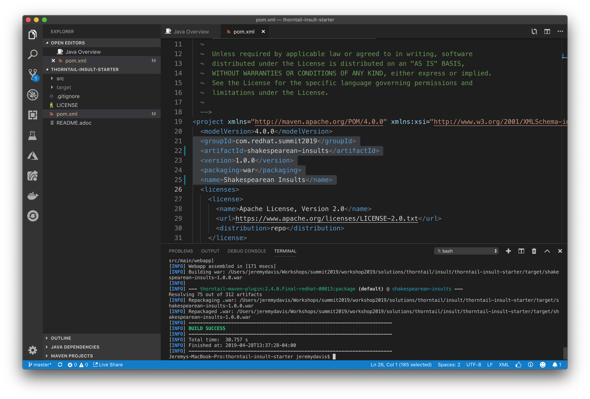
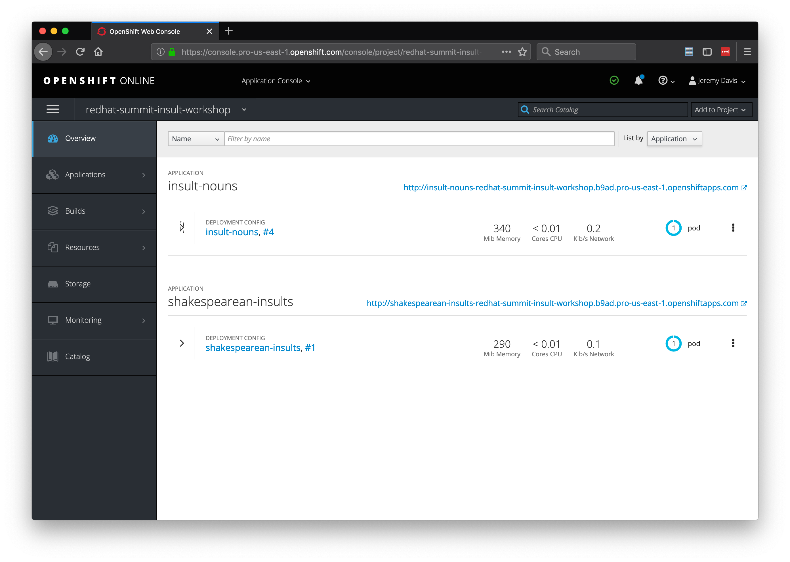
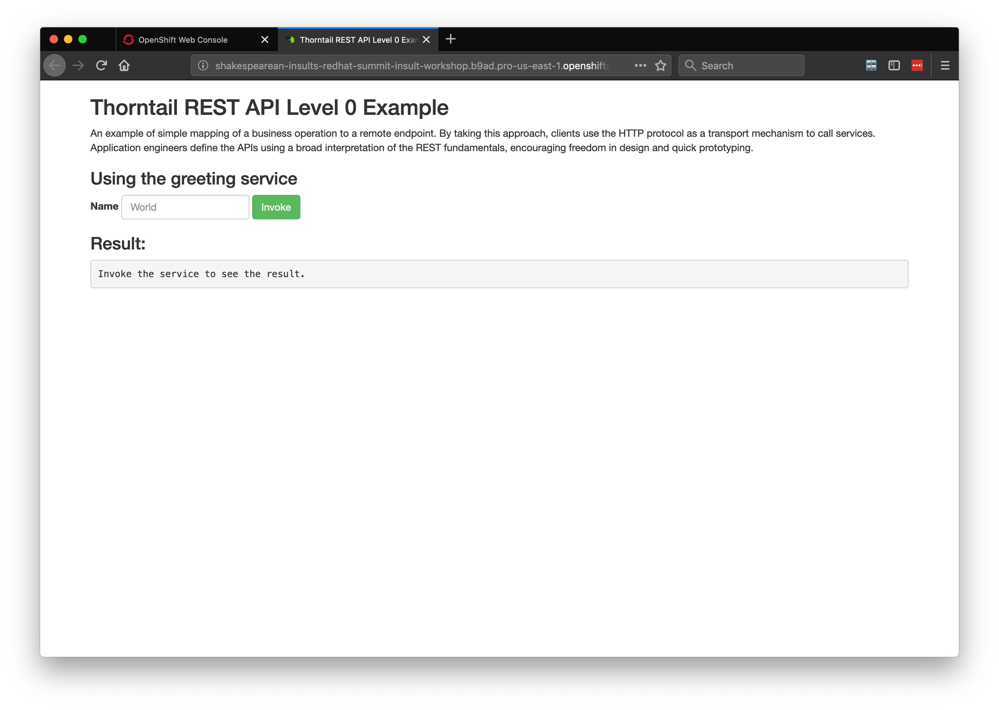
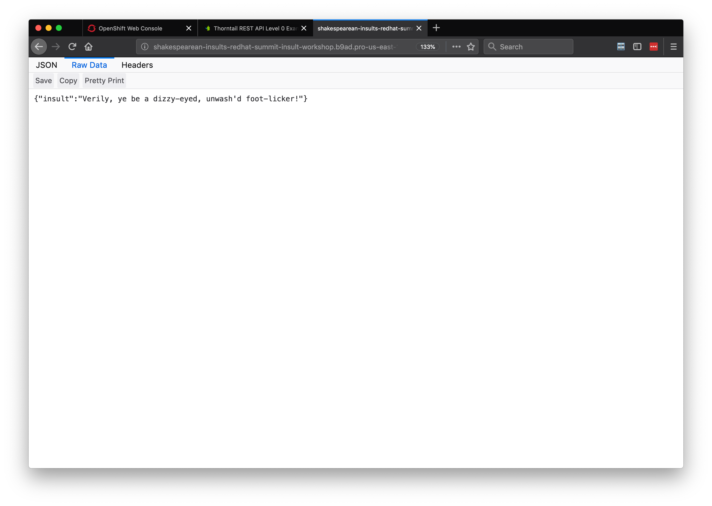

# Lab 5 Thorntail Insult Service

## First Steps

1. Import the app into VS Code
2. Update the starter app
3. Build
4. Deploy to OpenShift

### Import the app into VS Code

Open Visual Studio Code, choose "Open," and navigate to the root folder of the project

### Update the app

Our first step will be to customize the starter application.  Open the pom.xml and change lines 22 and 25 to be "shakespearean-insult" and "Shakespearean Insults" respectively:

```xml

20  <modelVersion>4.0.0</modelVersion>
21  <groupId>com.redhat.summit2019</groupId>
22  <artifactId>shakespearean-insults</artifactId>
23  <version>1.0.0</version>
24  <packaging>war</packaging>
25  <name>Shakespearean Insults</name>

``` 

The tests should all complete successfully, and you should see a success message.

  

### Deploying to OpenShift  

#### Building a Docker container for OpenShift

We will use the Fabric8 Maven Plugin to deploy our application to OpenShift.  The fabric8 plugin is already part of your pom.xml.  Check out lines 214-226:

```xml

          <plugin>
            <groupId>io.fabric8</groupId>
            <artifactId>fabric8-maven-plugin</artifactId>
            <executions>
              <execution>
                <id>fmp</id>
                <goals>
                  <goal>resource</goal>
                  <goal>build</goal>
                </goals>
              </execution>
            </executions>
          </plugin>

```

You can read more about the Fabric8 project here, http://fabric8.io/


#### Log in to OpenShift

You may still be logged into OpenShift.  You can check by running the following command:

```bash

oc whoami

```

If the response is your username then you are still logged in.  If you are still logged in you can skip the next step.

Fabric8 will build a Docker container and deploy it to OpenShift for us, but we need to be logged in first.  From your OpenShift console copy the login command by clicking on your name in the top right and choosing, "Copy Login Command."

  

Paste and enter the command into your terminal

  


#### Build and deploy to OpenShift

Now we can deploy our app.  From the terminal run the following maven command:

```bash

mvn clean fabric8:deploy -Popenshift  

```

This build will take longer because we are building Docker containers in addition to our Spring Boot application.  When the build and push to OpenShift is complete you will see a success message similar to the following:

```bash

[INFO] F8: HINT: Use the command `oc get pods -w` to watch your pods start up
[INFO] ------------------------------------------------------------------------
[INFO] BUILD SUCCESS
[INFO] ------------------------------------------------------------------------
[INFO] Total time:  06:40 min
[INFO] Finished at: 2019-04-24T12:49:12-04:00
[INFO] ------------------------------------------------------------------------

```

  

  

## Implement the Insult Microservice

We will take the same, test-driven approach to building the Insult Service that we did for the Adjective and Noun Services.

### Create and fail a JUnit Test for our endpoint

1. Create a new test class, InsultResourceTest.java, and enter the following content:

```java

package com.redhat.summit2019;

import com.github.tomakehurst.wiremock.junit.WireMockRule;
import com.github.tomakehurst.wiremock.stubbing.Scenario;
import org.jboss.arquillian.container.test.api.RunAsClient;
import org.jboss.arquillian.junit.Arquillian;
import org.junit.Assert;
import org.junit.Rule;
import org.junit.Test;
import org.junit.runner.RunWith;
import org.wildfly.swarm.arquillian.DefaultDeployment;

import javax.ws.rs.client.Client;
import javax.ws.rs.client.ClientBuilder;
import javax.ws.rs.client.WebTarget;
import javax.ws.rs.core.MediaType;
import javax.ws.rs.core.Response;

import static com.github.tomakehurst.wiremock.client.WireMock.*;
import static com.github.tomakehurst.wiremock.core.WireMockConfiguration.options;


@RunWith(Arquillian.class)
@DefaultDeployment
public class InsultResourceTest {

    @Rule
    public WireMockRule wireMockRule = new WireMockRule(options().port(8081));

    @Test
    @RunAsClient
    public void testInsultResource(){

        stubFor(get(urlEqualTo("/api/adjective"))
                .inScenario("insult-scenario")
                .whenScenarioStateIs(Scenario.STARTED)
                .willReturn(aResponse()
                        .withStatus(200)
                        .withHeader("Content-Type", "application/json")
                        .withBody("{\"adjective\": \"puking\"}"))
                .willSetStateTo("initial insult retrieved"));

        stubFor(get(urlEqualTo("/api/adjective"))
                .inScenario("insult-scenario")
                .whenScenarioStateIs("initial insult retrieved")
                .willReturn(aResponse()
                        .withStatus(200)
                        .withHeader("Content-Type", "application/json")
                        .withBody("{\"adjective\": \"beslubbering\"}"))
                .willSetStateTo("initial insult retrieved"));

        stubFor(get(urlPathMatching("/api/noun"))
                .willReturn(aResponse()
                        .withStatus(200)
                        .withHeader("Content-Type", "application/json")
                        .withBody("{\"noun\": \"pantaloon\"}")));

        Client client = ClientBuilder.newClient();
        WebTarget target = client.target("http://localhost:8080")
                .path("api").path("insult");

        Response response = target.request(MediaType.APPLICATION_JSON).get();
        Assert.assertEquals(200, response.getStatus());
        String returnedInsult = response.readEntity(String.class);
        Assert.assertEquals(returnedInsult, "{\"insult\":\"Verily, ye be a puking, beslubbering pantaloon!\"}");
    }

}

```

There are a couple of things here that may not be familiar.  First, we are using WireMock to stub our our Adjective and Noun services:

```java

import static com.github.tomakehurst.wiremock.client.WireMock.*;
import static com.github.tomakehurst.wiremock.core.WireMockConfiguration.options;

...

    stubFor(get(urlEqualTo("/api/adjective"))
            .inScenario("insult-scenario")
            .whenScenarioStateIs(Scenario.STARTED)
            .willReturn(aResponse()
                    .withStatus(200)
                    .withHeader("Content-Type", "application/json")
                    .withBody("{\"adjective\": \"puking\"}"))
            .willSetStateTo("initial insult retrieved"));

    stubFor(get(urlEqualTo("/api/adjective"))
            .inScenario("insult-scenario")
            .whenScenarioStateIs("initial insult retrieved")
            .willReturn(aResponse()
                    .withStatus(200)
                    .withHeader("Content-Type", "application/json")
                    .withBody("{\"adjective\": \"beslubbering\"}"))
            .willSetStateTo("initial insult retrieved"));

    stubFor(get(urlPathMatching("/api/noun"))
            .willReturn(aResponse()
                    .withStatus(200)
                    .withHeader("Content-Type", "application/json")
                    .withBody("{\"noun\": \"pantaloon\"}")));

```

WireMock spins up mock web server and returns the subs we defined.  We are using WireMock Scenarios to return different adjectives:

```java

    .inScenario("insult-scenario")
    .whenScenarioStateIs(Scenario.STARTED)

```

The second part that might not be familiar is the RestEasy client; however, if you have ever used a REST Client RESTEasy should feel familiar:

```java

    Client client = ClientBuilder.newClient();
    WebTarget target = client.target("http://localhost:8080")
            .path("api").path("insult");

    Response response = target.request(MediaType.APPLICATION_JSON).get();
    Assert.assertEquals(200, response.getStatus());
    String returnedInsult = response.readEntity(String.class);


```

RESTEasy handles the call to our Insult Service and translates the result into a String that we can run Assertions agains.

Run the test either by Clicking the "Run Test" link in the IDE (just under the @Test annotation) or in the terminal with:

```bash

mvn clean test -Dtest=InsultResourceTest

```

Obviously our test should fail.  If for some reason it passes feel free to raise your hand and ask for help.

### Pass our JUnit test

#### Steps

1.  Create a domain model with an Adjective, Noun, and Insult
2.  Create Spring RestTemplates to call the Adjective and Noun Services
3.  Create an InsultService that retrieves 2 adjectives and a noun and returns a complete Insult

####  Create our Domain Models  

We are only returning a String and don't really need a domain model, but to be consistent with the rest of the tutorial and of course real applications we will create a domain models for our application.  

Create classes for our three models, "Adjective," "Noun," and "Insult."

You may be wondering why we are re-creating the Adjective and Noun classes instead of using the ones we created earlier.  The answer is that we don't want any dependencies across Services.

"Insult" in the package, "com.redhat.summit2019.model"

Our Insult model will contain 2 Adjectives and 1 Noun and will return an insult in the format of "Verily, ye be a cockle-brained, puking measle!"  

```java

package com.redhat.summit2019.model;

public class Insult {

    Adjective adjective1;

    Adjective adjective2;

    Noun noun;

    public Insult(Adjective adjective1, Adjective adjective2, Noun noun) {
        this.adjective1 = adjective1;
        this.adjective2 = adjective2;
        this.noun = noun;
    }

    public String getInsult() {
        StringBuilder builder = new StringBuilder();
        builder.append("Verily, ye be a ");
        builder.append(adjective1.getAdjective());
        builder.append(", ");
        builder.append(adjective2.getAdjective());
        builder.append(" ");
        builder.append(noun.getNoun());
        builder.append("!");
        return builder.toString();
    }

    public Insult() {
    }

    @Override
    public String toString(){
        StringBuilder builder = new StringBuilder();
        builder.append("{");
        builder.append("\"insult\":\"");
        builder.append(getInsult());
        builder.append("\"");
        builder.append("}");
        return builder.toString();

    }

    public Adjective getAdjective1() {
        return adjective1;
    }

    public void setAdjective1(Adjective adjective1) {
        this.adjective1 = adjective1;
    }

    public Adjective getAdjective2() {
        return adjective2;
    }

    public void setAdjective2(Adjective adjective2) {
        this.adjective2 = adjective2;
    }

    public Noun getNoun() {
        return noun;
    }

    public void setNoun(Noun noun) {
        this.noun = noun;
    }
}


```

We also need Adjective and Noun domain models for our Insult to compile.  Create the Adjective and Noun models in the same package with the following code for Adjective:

```java

package com.redhat.summit2019.model;

import java.util.Objects;

public class Adjective {

    private String adjective;


    public Adjective() {
    }

    public Adjective(String adjective) {
        this.adjective = adjective;
    }

    public String getAdjective() {
        return adjective;
    }

    public void setAdjective(String adjective) {
        this.adjective = adjective;
    }

    @Override
    public boolean equals(Object o) {
        if (this == o) return true;
        if (o == null || getClass() != o.getClass()) return false;
        Adjective adjective1 = (Adjective) o;
        return Objects.equals(getAdjective(), adjective1.getAdjective());
    }

    @Override
    public int hashCode() {

        return Objects.hash(getAdjective());
    }

    @Override
    public String toString() {
        StringBuffer sb = new StringBuffer("Adjective{");
        sb.append("adjective='").append(adjective).append('\'');
        sb.append('}');
        return sb.toString();
    }

}

```

and Noun:

```java

package com.redhat.summit2019.model;

import java.util.Objects;

public class Noun {

    private String noun;

    public Noun() {
    }

    public Noun(String noun) {
        this.noun = noun;
    }

    public String getNoun() {
        return noun;
    }

    public Noun noun(String noun) {
        this.noun = noun;
        return this;
    }

    public boolean equals(Object o) {
        if (this == o)
            return true;
        if ((o == null) || (getClass() != o.getClass()))
            return false;
        Noun noun1 = (Noun) o;
        return Objects.equals(noun, noun);
    }

    public int hashCode() {
        return Objects.hash(new Object[]{noun});
    }

    public String toString() {
        StringBuffer sb = new StringBuffer("Noun{");
        sb.append("noun='").append(noun).append('\'');
        sb.append('}');
        return sb.toString();
    }

}

```

It's not a bad idea to run a quick build just to make sure everything was typed in correctly.  Be sure to skip the tests for now:

```bash

 mvn clean pacakge -DskipTests

```

The application should compile and build with no problems.

#### Create the Insult Service

Now that we have modeled our domain we can build our service.  Create a class, "InsultResource," in the "com.redhat.summit2019" package with the following code:

```java

package com.redhat.summit2019;

import com.redhat.summit2019.model.Insult;
import org.jboss.resteasy.client.jaxrs.ResteasyClient;
import org.jboss.resteasy.client.jaxrs.ResteasyClientBuilder;
import org.jboss.resteasy.client.jaxrs.ResteasyWebTarget;

import javax.enterprise.context.ApplicationScoped;
import javax.ws.rs.GET;
import javax.ws.rs.Path;
import javax.ws.rs.Produces;
import javax.ws.rs.core.MediaType;

@Path("/")
@ApplicationScoped
public class InsultResource{

    @Inject @ConfigProperty(name="url.adjective")
    private String adjectiveURL;

    @Inject @ConfigProperty(name="url.noun")
    private String nounURL;

    @GET
    @Produces(MediaType.APPLICATION_JSON)
    @Path("/insult")
    public String getInsult() throws Exception {

        ResteasyClient nounClient = new ResteasyClientBuilder().build();
        ResteasyWebTarget nounTarget = nounClient.target(nounURL);
        NounService nounService = nounTarget.proxy(NounService.class);

        ResteasyClient adjClient = new ResteasyClientBuilder().build();
        ResteasyWebTarget adjTarget = adjClient.target(adjectiveURL);
        AdjectiveService adjService = adjTarget.proxy(AdjectiveService.class);

        return new Insult(adjService.getAdjective(),
            adjService.getAdjective(),
            nounService.getNoun()).toString();
    }

}

```

We are injecting 2 properties from a configuration file, "adjectiveURL," and "nounURL."  The configuration file is location in "src/main/resources/META-INF" and contains the following properties:

```

# Local
url.adjective=http://localhost:8081
url.noun=http://localhost:8081

# OpenShift
# url.adjective=http://insult-adjectives:8080
# url.noun=http://insult-nouns:8080

```

Kubernetes will resolve applications based on their names so, "http://insult-adjectives:8080" will work once we deploy to OpenShift.  However, for testing we want to use our local server, "http://localhost:8081," as configured in our InsultResourceTest.

IMPORTANT: Be sure to update these before deploying to OpenShift!

Re-run the test either by Clicking the "Run Test" link in the IDE (just under the @Test annotation) or in the terminal with:

```bash

mvn clean test -Dtest=InsultResourceTest

```

  

At this point our test should pass.  If for some reason it doesn't feel free to raise your hand and ask for help.

### Deploy to OpenShift

Open the microprofile-config.properties file and swap the properties so that the urls point to insult-adjectives and insult-nouns:

```

# Local
# url.adjective=http://localhost:8081
# url.noun=http://localhost:8081

# OpenShift
url.adjective=http://insult-adjectives:8080
url.noun=http://insult-nouns:8080

```

Now we can deploy our app.  From the terminal run the following maven command (and be sure to skip the tests):

```bash

mvn clean fabric8:deploy -Popenshift -DskipTests

```

We have to skip the tests because we have changed the microprofile-config.properties to our OpenShift properties.

This build will take longer because we are building Docker containers in addition to our Spring Boot application.  When the build and push to OpenShift is complete you will see a success message similar to the following:

```bash

[INFO] F8: HINT: Use the command `oc get pods -w` to watch your pods start up
[INFO] ------------------------------------------------------------------------
[INFO] BUILD SUCCESS
[INFO] ------------------------------------------------------------------------
[INFO] Total time:  06:40 min
[INFO] Finished at: 2019-04-24T12:49:12-04:00
[INFO] ------------------------------------------------------------------------

```

  

This time let's verify the application by pulling up the insult endpoint:

  


