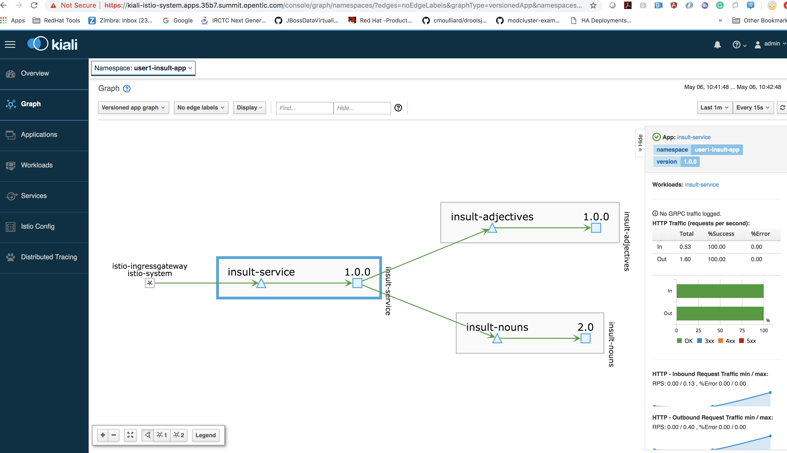
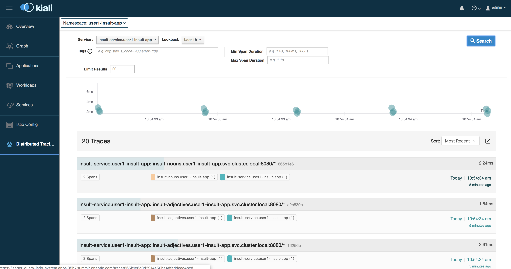

# Lab 6 Istio

## Pre-requisites
We will be using those components for following labs


Prerequisites +
* Istio is installed and running on OpenShift +
* Your administrator has assigned you a userid +
* Deployed Noun, adjective and Insult Service

### Enable Istio for the InsultGateway  service


#### * Step1 - Login to openshift +
```java

oc login https://master.35b7.summit.opentlc.com/login -u $USER_ID -p $PWD

```

#### * Step 2 - Enable Istio Automatic injection @ Noun Service

You can use any of the noun service i.e SpringBoot, Thorntile, Vert.x or Node.js. In this example , we will be using SpringBoot

```bash

cd insult-nouns


```
#### * Step 2.1 Edit insult-nouns/pom.xml

```xml
<plugin>
  <groupId>io.fabric8</groupId>
  <artifactId>fabric8-maven-plugin</artifactId>
  <version>4.1.0</version>
  <executions>
    <execution>
      <goals>
        <goal>resource</goal>
        <goal>build</goal>
      </goals>
    </execution>
  </executions>
  <configuration>
    <resources>
      <annotations>
        <deployment>
          <property>
            <name>sidecar.istio.io/inject</name>
            <value>true</value>
          </property>
        </deployment>
      </annotations>
    </resources>
  </configuration>
</plugin>

```

Please review the above fabric8-maven-plugin configuration, we are enabling istio side car injection while deploying the application with property sidecar.istio.io/inject

#### * Step 3 - Deploy Noun service

``` bash
mvn clean deploy:fabric8 -Popenshift


```
Please make sure build is successful
``` bash


[INFO] Created Service: target/fabric8/applyJson/user1-insult-app/service-insult-nouns.json
[INFO] Using project: user1-insult-app
[INFO] Creating a DeploymentConfig from openshift.yml namespace user1-insult-app name insult-nouns
[INFO] Created DeploymentConfig: target/fabric8/applyJson/user1-insult-app/deploymentconfig-insult-nouns.json
[INFO] Creating Route user1-insult-app:insult-nouns host: null
[INFO] F8: HINT: Use the command `oc get pods -w` to watch your pods start up
[INFO] ------------------------------------------------------------------------
[INFO] BUILD SUCCESS
[INFO] ------------------------------------------------------------------------
[INFO] Total time: 02:07 min
[INFO] Finished at: 2019-05-06T07:52:11-04:00
```

#### *Step 4 - Enable Istio Automatic injection @ Adjective Service
You can use any of the adjective service i.e SpringBoot, Thorntile, Vert.x or Node.js. In this example , we will be using SpringBoot

```bash

cd insult-adjectives


```
#### * Step 4.1 Edit insult-solution-adjective-service-springboot-master/pom.xml

```xml
<plugin>
  <groupId>io.fabric8</groupId>
  <artifactId>fabric8-maven-plugin</artifactId>
  <version>4.1.0</version>
  <executions>
    <execution>
      <goals>
        <goal>resource</goal>
        <goal>build</goal>
      </goals>
    </execution>
  </executions>
  <configuration>
    <resources>
      <annotations>
        <deployment>
          <property>
            <name>sidecar.istio.io/inject</name>
            <value>true</value>
          </property>
        </deployment>
      </annotations>
    </resources>
  </configuration>
</plugin>

```

Please review the above fabric8-maven-plugin configuration, we are enabling istio side car injection while deploying the application with property sidecar.istio.io/inject

#### * Step 5 - Deploy Adjective service

``` bash
mvn clean deploy:fabric8 -Popenshift


```
Please make sure build is successful
``` bash
[INFO] F8: Using project: user1-insult-app
[INFO] F8: Creating a Service from openshift.yml namespace user1-insult-app name insult-adjectives
[INFO] F8: Created Service: target/fabric8/applyJson/user1-insult-app/service-insult-adjectives.json
[INFO] F8: Creating a DeploymentConfig from openshift.yml namespace user1-insult-app name insult-adjectives
[INFO] F8: Created DeploymentConfig: target/fabric8/applyJson/user1-insult-app/deploymentconfig-insult-adjectives.json
[INFO] F8: Creating Route user1-insult-app:insult-adjectives host: null
[INFO] F8: HINT: Use the command `oc get pods -w` to watch your pods start up
[INFO] ------------------------------------------------------------------------
[INFO] BUILD SUCCESS
[INFO] ------------------------------------------------------------------------
[INFO] Total time: 01:25 min
[INFO] Finished at: 2019-05-06T07:59:58-04:00
[INFO] ------------------------------------------------------------------------


```
#### *Step 6 - Enable Istio Automatic injection @ Insult Service
You can use any of the Insult service i.e SpringBoot, Thorntile, Vert.x or Node.js. In this example , we will be using SpringBoot

```bash

cd insult-service


```
#### * Step 6.1 Edit insult-solution-insult-service-springboot-master/pom.xml

```xml
<plugin>
  <groupId>io.fabric8</groupId>
  <artifactId>fabric8-maven-plugin</artifactId>
  <version>4.1.0</version>
  <executions>
    <execution>
      <goals>
        <goal>resource</goal>
        <goal>build</goal>
      </goals>
    </execution>
  </executions>
  <configuration>
    <resources>
      <annotations>
        <deployment>
          <property>
            <name>sidecar.istio.io/inject</name>
            <value>true</value>
          </property>
        </deployment>
      </annotations>
    </resources>
  </configuration>
</plugin>

```

Please review the above fabric8-maven-plugin configuration, we are enabling istio side car injection while deploying the application with property sidecar.istio.io/inject

#### * Step 7 - Deploy Insult service

``` bash
mvn clean deploy:fabric8 -Popenshift


```
Please make sure build is successful

``` bash
INFO] F8: Using project: user1-insult-app
[INFO] F8: Creating a Service from openshift.yml namespace user1-insult-app name insult-service
[INFO] F8: Created Service: target/fabric8/applyJson/user1-insult-app/service-insult-service.json
[INFO] F8: Creating a DeploymentConfig from openshift.yml namespace user1-insult-app name insult-service
[INFO] F8: Created DeploymentConfig: target/fabric8/applyJson/user1-insult-app/deploymentconfig-insult-service.json
[INFO] F8: Creating Route user1-insult-app:insult-service host: null
[INFO] F8: HINT: Use the command `oc get pods -w` to watch your pods start up
[INFO] ------------------------------------------------------------------------
[INFO] BUILD SUCCESS
[INFO] ------------------------------------------------------------------------
[INFO] Total time: 01:26 min
[INFO] Finished at: 2019-05-06T08:06:21-04:00
[INFO] ------------------------------------------------------------------------


```


#### * Step 8 - Create a Gateway to access your application
In order to make your application accessible from outside the cluster, an Istio Gateway is required. Let us understand gateway and virtual service configurations

```xml
apiVersion: networking.istio.io/v1alpha3
kind: Gateway
metadata:
  name: insult-app-gateway
spec:
  selector:
    istio: ingressgateway # use Istio default gateway implementation
  servers:
  - port:
      number: 80
      name: http
      protocol: HTTP
    hosts:
    - "insult-service-user1-insult-app.apps.35b7.summit.opentlc.com"
---
apiVersion: networking.istio.io/v1alpha3
kind: VirtualService
metadata:
  name: insult-app-virtual-service
spec:
  hosts:
  - "insult-service-user1-insult-app.apps.35b7.summit.opentlc.com"
  gateways:
  - insult-app-gateway
  http:
  - match:
    - uri:
        prefix: /api/insult
    rewrite:
      uri: /api/insult
    route:
    - destination:
        port:
          number: 8080
        host: insult-service
  - match:
    - uri:
        prefix: /api/noun
    rewrite:
      uri: /api/noun
    route:
    - destination:
        port:
          number: 8080
        host: insult-nouns
  - match:
    - uri:
        prefix: /api/adjective
    rewrite:
      uri: /api/adjective
    route:
    - destination:
        port:
          number: 8080
        host: insult-adjectives
```
#### Gateway :
A Gateway configures a load balancer for HTTP/TCP traffic, most commonly operating at the edge of the mesh to enable ingress traffic for an application. The above gateway will direct all the HTTP traffic coming on port 80 at istio-ingressgateway to the insult application.

The selector istio: ingressgateway pull the traffic coming to istio-ingressgateway service in the istio-system project
The parameter hosts:  says that  traffic coming to this insult-app-gateway for any hostname will be consumed. If we want our application to cater to specific hostnames, we should list those here instead of using *

#### VirtualService:
 A VirtualService defines the rules that control how requests for a service are routed within an Istio service mesh. With the above virtualservice configuration:

gateways: - insult-app-gateway configures it to listens to traffic coming to insult-app-gateway defined earlier
host: "*" caters to any hostnames. If we want specific hostname, we can change this to a specific hostname.
URI matching allows it to listen to /insult etc.

#### * Step 8.1 - create below gateway/virtual service config to your apps

create a file with name gateway.yml with the below contents. You can create it of any location of ur choice

Replace all the occurances of userx with your specific assigned user id

```xml
```xml
apiVersion: networking.istio.io/v1alpha3
kind: Gateway
metadata:
  name: insult-app-gateway
spec:
  selector:
    istio: ingressgateway # use Istio default gateway implementation
  servers:
  - port:
      number: 80
      name: http
      protocol: HTTP
    hosts:
    - "insult-service-userx-insult-app.apps.35b7.summit.opentlc.com"
---
apiVersion: networking.istio.io/v1alpha3
kind: VirtualService
metadata:
  name: insult-app-virtual-service
spec:
  hosts:
  - "insult-service-userx-insult-app.apps.35b7.summit.opentlc.com"
  gateways:
  - insult-app-gateway
  http:
  - match:
    - uri:
        prefix: /api/insult
    rewrite:
      uri: /api/insult
    route:
    - destination:
        port:
          number: 8080
        host: insult-service
  - match:
    - uri:
        prefix: /api/noun
    rewrite:
      uri: /api/noun
    route:
    - destination:
        port:
          number: 8080
        host: insult-nouns
  - match:
    - uri:
        prefix: /api/adjective
    rewrite:
      uri: /api/adjective
    route:
    - destination:
        port:
          number: 8080
        host: insult-adjectives
```
Example: Below is the gateway config for user1 (replace user1 with ur USER_ID)


```xml
```xml
apiVersion: networking.istio.io/v1alpha3
kind: Gateway
metadata:
  name: insult-app-gateway
spec:
  selector:
    istio: ingressgateway # use Istio default gateway implementation
  servers:
  - port:
      number: 80
      name: http
      protocol: HTTP
    hosts:
    - "insult-service-user1-insult-app.apps.35b7.summit.opentlc.com"
---
apiVersion: networking.istio.io/v1alpha3
kind: VirtualService
metadata:
  name: insult-app-virtual-service
spec:
  hosts:
  - "insult-service-user1-insult-app.apps.35b7.summit.opentlc.com"
  gateways:
  - insult-app-gateway
  http:
  - match:
    - uri:
        prefix: /api/insult
    rewrite:
      uri: /api/insult
    route:
    - destination:
        port:
          number: 8080
        host: insult-service
  - match:
    - uri:
        prefix: /api/noun
    rewrite:
      uri: /api/noun
    route:
    - destination:
        port:
          number: 8080
        host: insult-nouns
  - match:
    - uri:
        prefix: /api/adjective
    rewrite:
      uri: /api/adjective
    route:
    - destination:
        port:
          number: 8080
        host: insult-adjectives

```
#### * Step 9 - Apply gateway config

```
oc apply -f gateway.yml -n user1-insult-app
gateway.networking.istio.io "insult-app-gateway" created
virtualservice.networking.istio.io "insult-app-virtual-service" created

```

In order to access this application from outside the cluster you will use http://insult-service-user1-insult-app.apps.35b7.summit.opentlc.com/api/insult

So how does the routing work?

Let us take a closer look at the pods running in the istio-system project specifically for the ior pod.

```bash

oc get po -n istio-system | grep ior
ior-5f4fd8c7cf-5w2cv                      1/1       Running   0          9h
```
This pod automatically creates a new route in the istio-system project for every host entry in the gateway by exposing istio-ingressgateway. So in the above example it creates an openshift route for based on the value assigned in the gateway

```xml
- hosts:
    - insult-service-user1-insult-app.apps.35b7.summit.opentlc.com
```
So, let us check istio-system projects for routes for istio-ingressgateway service. You will see two routes.

```bash
oc get route -n istio-system | grep istio-ingressgateway
insult-app-gateway-kw6dq   insult-service-user1-insult-app.apps.35b7.summit.opentlc.com               istio-ingressgateway   <all>                   None
istio-ingressgateway       istio-ingressgateway-istio-system.apps.35b7.summit.opentlc.com             istio-ingressgateway   80                      None
```

One of these routes is the route named istio-ingressgateway that was created when the Istio control plane was deployed The other one named as insult-app-gateway-kw6dq (in your case the name could be slightly different), is the one that is just automatically added by IOR pod.

Note: If multiple people are creating their apps, there may be many routes as IOR will expose all those routes.

So when you access your application hostname (in this case insult-service-user1-insult-app.apps.35b7.summit.opentlc.com), since there is an openshift route, the request will come to istio-ingressgateway service. Based on the gateway and virtualservice configurations discussed above, the traffic will land in your application.

To summarize the routing:

Client --> OpenShiftRouter--> istio-ingressgateway-->insult-app-gateway--> insult-app-virtualservice--> api/insult service

* OpenShift router receives the traffic for the default domain (in my case *.apps.35b7.summit.opentlc.com)
* Istio-ingressgateway service receives the traffic via autogenerated ior route
* insult-app-gateway receives traffic for specific application hostname (in the above case nsult-service-user1-insult-app.apps.35b7.summit.opentlc.com)
* insult-app- virtualservice redirects the traffic to specific endpoints exposed by the application.

Note:  Your URLs would be different from mine. So use your values.


So I can access the product page at the URL

http://insult-service-user1-insult-app.apps.35b7.summit.opentlc.com/api/insult


 hit the url a few times, so generate traffic

#### Service Graph

Check the service graph on kiali at https://kiali-istio-system.apps.35b7.summit.opentlc.com . userid/password(admin/admin) You can use the Graph menu item on the left of Kiala to view this graph as below


please check your specific project , in my case it is user1-insult-app. replace user1 with your assigned userid


Right next to the service graph, you will see a summary of the traffic success and error rates which gives you a snapshot of the health of your microservices running on the platform



#### Application Metrics

Click on the Applications menu to get an application centric view of different microservices, their health/error rate and their inbound and outbound metrics such as Request Volume, Request Duration, Request Size, Response Size etc. These are helpful for debugging your microservices as you use them further.


#### Tracing

Click on Distributed Tracing	on the Kiali menu to connect to Jaeger.

Note If you are not getting redirected to Jaeger, you may have to enable popups from Kiali page

Jaeger provides tracing info for all the calls you made. Select a service on the left hand menu such as istio-ingressgateway or insult-service and you will see the list of traces for all your usage.



#### Destination Rules


We have the Insult  application running now. Let's apply some destination rules  that will allow us to shape traffic according to the subsets we define in these rules.

A DestinationRule configures the set of policies to be applied to a request after VirtualService routing has occurred.

Let us first look at these destination rules. These are three rules applies to /api/insult, /api/noun, and /api/adjective. The rules define subsets based on the version labels. These subsets will be used in the future labs for traffic shaping

Create a file called destinationRule-insult.yml in the location of your choice.

```xml
apiVersion: networking.istio.io/v1alpha3
kind: DestinationRule
metadata:
  name: insult-service
spec:
  host: insult-service
  trafficPolicy:
    tls:
      mode: ISTIO_MUTUAL
  subsets:
  - name: v1
    labels:
      version: 1.0.0
---
apiVersion: networking.istio.io/v1alpha3
kind: DestinationRule
metadata:
  name: insult-nouns
spec:
  host: insult-nouns
  trafficPolicy:
    tls:
      mode: ISTIO_MUTUAL
  subsets:
  - name: v1
    labels:
      version: v1
  - name: v2
    labels:
      version: v2
---
apiVersion: networking.istio.io/v1alpha3
kind: DestinationRule
metadata:
  name: insult-adjectives
spec:
  host: insult-adjectives
  trafficPolicy:
    tls:
      mode: ISTIO_MUTUAL
  subsets:
  - name: v1
    labels:
      version: 1.0.0


```

Let us now apply these labels by running. replace USER_PROJECT with the assigned user project

```bash
oc apply -f destinationRule-insult.yml -n {USER-PROJECT}
```

Get back to Kiala menu option Istio Config on the left to find these destination rules. Istio Config can be used to view all the rules applied on the traffic at any point of time.
