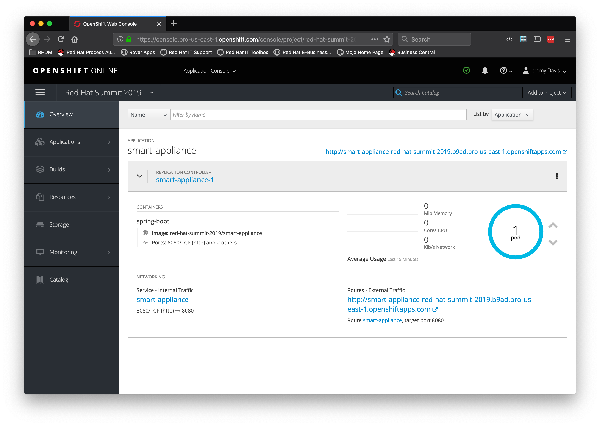

# Lab-7-SpringBoot-Twitter_Service.md

## Create a Project for the Spring Boot Twitter Service  

###  Clone the repository 

If you've come this far you've probably figured out the first step by now

```bash

git clone https://github.com/jeremyrdavis/insult-starter-springboot

```

### Or download the project zip file

You can download the zip file from Github by opening https://github.com/jeremyrdavis/insult-starter-springboot
and choosing, "Download ZIP" from the green, "Clone or Download" button

  

### Rename the folder

Rename the folder from "insult-starter-springboot" to "twitter-service"

### Import the app into VS Code

Open Visual Studio Code, choose "Open," and navigate to the root folder of the project

### Update the project settings

We need to update our project's settings from the default starter app to the adjective service we are building.

Open the pom.xml file and change the artifactId, name, and description to 
"insult-tweets," "Spring Boot Insult Twitter Service," and "Spring Boot Twitter Service for Shakespearean Insults Workshop."

```xml

  <artifactId>insult-tweets</artifactId>
  <version>1.0.0</version>
  <name>Spring Boot Insult Twitter Service</name>
  <description>Spring Boot Twitter Service for Shakespearean Insults Workshop</description>

```

### Verify that the project builds

```bash

mvn clean package

```

The tests should all complete successfully, and you should see a success message.

  

  

### Verify that the project deploys to OpenShift  

We will use the Fabric8 Maven Plugin to deploy our application to OpenShift.  The fabric8 plugin is already part of your pom.xml.

```xml

          <plugin>
            <groupId>io.fabric8</groupId>
            <artifactId>fabric8-maven-plugin</artifactId>
            <executions>
              <execution>
                <id>fmp</id>
                <goals>
                  <goal>resource</goal>
                  <goal>build</goal>
                </goals>
              </execution>
            </executions>
          </plugin>

```

You can read more about the Fabric8 project here, http://fabric8.io/

#### Log in to OpenShift

You may still be logged into OpenShift.  You can check by running the following command:

```bash

oc whoami

```

If the response is your username then you are still logged in.  If you are still logged in you can skip the next step.

##### Log back in to OpenShift

Fabric8 will build a Docker container and deploy it to OpenShift for us, but we need to be logged in first.  From your OpenShift console copy the login command by clicking on your name in the top right and choosing, "Copy Login Command."

  

Paste and enter the command into your terminal

  


#### Build and deploy to OpenShift

Now we can deploy our app.  From the terminal run the following maven command:

```bash

mvn clean fabric8:deploy -Popenshift -DskipTests 

```

We have already run the tests so we will skip them to speed up the build

### Validating the deployment:  

1. Login to OpenShift Console - with your user name and password
2. Click on Project ‘red-hat-summit-2019’ if you are not already in that project
3. You should see 1 running pod and a url that you can access
4. Try the url


  


You should see:


  


## Get coding!

### Create and fail a JUnit Test for our endpoint

We are of course practicing TDD in this tutorial so our first step will be to write a Unit Test.  Create a new class, "TwitterServiceTest.java," in the "src/test/java/com/redhat/summit2019" directory with the following content:

```java

package com.redhat.summit2019;

import static io.restassured.RestAssured.given;
import static org.junit.Assert.assertNotNull;

import org.junit.Test;
import org.junit.runner.RunWith;
import org.springframework.beans.factory.annotation.Value;
import org.springframework.boot.test.context.SpringBootTest;
import org.springframework.test.context.junit4.SpringRunner;

import io.restassured.response.Response;

@RunWith(SpringRunner.class)
@SpringBootTest(webEnvironment = SpringBootTest.WebEnvironment.RANDOM_PORT)
public class TwitterServiceTest{

    private static final String ENDPOINT_PATH = "api/tweet";

    @Value("${local.server.port}")
    private int port;

    @Test
    public void testTwitterEndpoint() {
        Response response = given()
           .baseUri(baseURI())
           .parameters("insult", "Verily, ye be a pox-marked, rank blind-worm!")
           .post(ENDPOINT_PATH)
           .then()
           .statusCode(200)
           .extract().response();
        assertNotNull(response);
        System.out.println(response.toString());
    }

    protected String baseURI() {
        return String.format("http://localhost:%d", port);
    }

}

```

Run the test to verify that it fails:

```bash

mvn clean test

```

#### Pass our test

##### Update our pom.xml

Add the Twitter4j dependencies.  First, add the version in the pom's properties section:

```xml

    <twitter4j.version>[4.0,)</twitter4j.version>

```

Then add the dependency to the dependencies section:

```xml

    <dependency>
      <groupId>org.twitter4j</groupId>
      <artifactId>twitter4j-core</artifactId>
      <version>${twitter4j.version}</version>
    </dependency>

```

##### Add our Twitter properties

Create a file "twitter4j.properties" in src/main/resources:

```yaml

debug=true
oauth.consumerKey=YOUR_KEY
oauth.consumerSecret=YOUR_CONSUMER_SECRET
oauth.accessToken=YOUR_ACCESS_TOKEN
oauth.accessTokenSecret=YOUR_ACCESS_TOKEN_SECRET

```